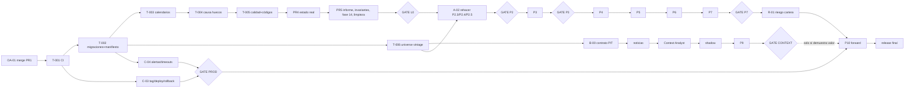

# Roadmap de intradia-bot

Fuente principal de **qué falta, qué depende de qué, qué está hecho, qué
está bloqueado, en qué orden y cuándo está terminado**. No contiene el
detalle operativo de cada tarea: eso vive en `docs/tareas/` y el método en
`docs/metodo-trabajo.md`.

| Documento | Para qué |
|---|---|
| `docs/metodo-trabajo.md` | Cómo se ejecuta cualquier tarea (obligatorio) |
| `docs/agent-workflow.md` | START HERE, reparto Opus/Codex, prompts, cola |
| `docs/gates.md` | Puertas entre bloques y paquete de revisión final |
| `docs/decision-log.md` | Decisiones tomadas; decisiones y acciones del propietario |
| `docs/tareas/T-nnn-*.md` | Fichas de tarea |
| `docs/plan-ejecucion.md` | Detalle de las fases 4–15 de la línea 0 |
| `docs/protocolo-investigacion.md` | Cómo se mide en P2–P7 |
| `docs/ratio-beneficio-riesgo.md` | Hallazgo medido sobre el ratio (histórico, vigente) |
| `docs/pendientes.md`, `docs/cobertura-especificacion.md` | **Históricos** (D-16): mediciones y diario hasta el 2 de septiembre; no son estado |
| `evidence/` | Evidencia reproducible por entrega |

---

## Estado verificado — 2026-09-14

Comprobado directamente contra el repositorio y ejecutando el sistema, no
leído en documentos:

| Qué | Valor |
|---|---|
| Rama / HEAD | `fix/execution-data-quality` / `e53e385`, 3 commits por delante de `main` (`6d32cf2`) |
| Árbol | limpio salvo `graphify-out/` (sin seguimiento) |
| Tests / lint / tipos | 398 pasan (87 s) · `ruff check .` limpio · `mypy advisor` limpio (54 ficheros) · Python 3.12.13 |
| PR 1 (fases 1–3) | hecho en rama: `advisor/analysis/execution.py`, `entry_max_for_rr`, `reward_risk`, `rr_at_least`, `position_limit_reason`, `classify_setup` separado de `classify`, regresión `EXH1.DE` |
| CI | `.github/workflows/ci.yml` en rama `ci/github-actions` (`e5ed089`), run verde en 3.12 y 3.13 |
| Esquema SQLite | v2 con migraciones (`PRAGMA user_version`), backup pre-migración verificado, `analysis_run` + `run_id` (T-002) |
| Calendarios | `advisor/data/calendars.py` con `exchange_calendars==4.13.2` y cripto 24/7; taxonomía única en `MARKET_SESSIONS` con MIC (rama `fix/exchange-calendars`, sin mergear) |
| Universo | 107 analizables + 19 contexto; 18 ISIN; 107/107 `trade_republic: unknown`; seleccionado el 2026-08-27/29 |
| Cosecha | `071ddb2b…`, 126 símbolos, 5 años, solo en el portátil (`data/vintages/` ignorado, 18 MB); manifiesto 87 KB |
| LLM | `claude-sonnet-5` vía `advisor/ai/`; prompt sin versión; narrativa **no** se persiste |
| Pi | `fer@Raspberry4` (192.168.1.113, clave `~/.ssh/id_ed25519_rpi_bot`): desplegada `feat/run-manifest-migrations` el 2026-09-14 (antes `main` `6d32cf2` sin PR 1); base migrada a v2 con backup verificado; 417 tests + 3 saltados en la Pi. Estado previo: Python 3.13.5; base `user_version` 0 con 2.503 recomendaciones y 1.177 mediciones de frescura (11 pasadas desde el 2 de septiembre); timers vivos; NTP sincronizado. Verificado por SSH el 2026-09-14 |
| Línea base real | `evidence/2026-09-14-L0-baseline/`: 107 activos; calidad OK 59 / INCOMPLETO 30 / DEGRADADO 18; 43 con «sesiones ausentes»; 1 OPERAR (`EXH1.DE`), 10 RADAR, 90 DESCARTADOS |

---

## Auditoría del roadmap anterior — qué cambia y por qué

Cada punto: qué cambió · por qué · qué evita.

1. **La línea C (ingeniería) existe y va por delante de PR 3.** CI,
   migraciones y manifiesto de ejecución (T-001, T-002) se hacen antes de que
   PR 3 y PR 4 añadan columnas y estados · porque el esquema no tiene versión
   y las pasadas no tienen identidad · evita migrar dos veces y producir
   recomendaciones irreproducibles durante la línea 0. (D-19)
2. **PR 1 cambió la política de entrada y hay que decirlo.** Con la geometría
   por defecto `entry_max_rr = precio de cierre` exactamente, así que
   `entry_max_atr: 0.75` no interviene y toda apertura al alza es
   `ABOVE_MAX_ENTRY` · el protocolo (hallazgo 4) había aplazado justo esto a
   P4 · la decisión D-06 mantiene la invariante y traslada la tensión a P4
   («holgura de entrada» como dimensión de la geometría) y a la fase 14
   (medir la pérdida a la apertura). Evita descubrir en P10 que casi nada es
   ejecutable a la apertura.
3. **El sesgo de universo se acota formalmente y P7 deja de ser «validación
   general».** Sección «Universo» abajo; `universe_vintage_id` (T-006);
   etiqueta obligatoria en P6/P7; **P10 Forward Validation** como prueba
   final no condicionada. (D-08)
4. **Calendarios de plaza reales, una sola taxonomía.** La línea base
   demuestra falsos huecos por festivos ajenos (`AZN` vetada por Labor Day)
   · se adopta `exchange_calendars` (D-07) y se elimina `_mercado_por_sufijo`
   · evita vetos falsos y dos vocabularios para la misma plaza.
5. **Corrección de una afirmación del roadmap anterior:** «`POLICY_TODAS` es
   la población de control del estudio y también se mueve». El event study
   (P2.3) entra al cierre de señal y **no** depende de `entry_max`; lo que se
   mueve es el backtest (`POLICY_OPERAR`/`TODAS`, entrada a la apertura
   siguiente). P2.3/P2.4 se rehacen igualmente por la fortaleza relativa y por
   la línea 0 (D-18), pero por el motivo correcto.
6. **«Recalibrar con los 107» ya no es una fase.** P2.3 ya midió 121.786
   señales sobre los 107; lo que salía de 21 activos era el `backtest` antiguo
   (`europa`, `usa_en_xetra`, `etfs_ucits`). Se retira como fase y se conserva
   como nota histórica.
7. **Fases nuevas que faltaban:** versionado y regresiones del LLM (B-06,
   C-05), reloj/NTP (C-02, C-04), despliegue por tag y rollback (C-03),
   restauración de backups probada (C-01), riesgo de cartera con gate
   (R-01), forward validation (V-01), identidad emisor/instrumento (T-006,
   D-20), ficha de proveedor obligatoria (B-00).
8. **Observación nueva:** `YahooEarningsSource` consulta «próximos
   resultados» en vivo; no es point-in-time y no puede usarse en backtests
   sin el contrato B0. Hoy no puntúa, así que no contamina nada.
9. **«Un commit por fase» se retira** (D-15). Una entrega coherente, commits
   compilables.
10. `docs/pendientes.md` y `docs/cobertura-especificacion.md` pasan a
    históricos (D-16). Este documento es el único estado.

---

## Principios

Reglas de arquitectura; una entrega que las incumpla se devuelve. Las
invariantes numeradas (INV-xx) están en `docs/metodo-trabajo.md` sección 2.

- **Determinismo.** El LLM no calcula indicadores, score, entrada, stop,
  objetivos, RR, tamaño, riesgo ni clasificación. Interpreta lo ya calculado.
- **Point-in-time.** `available_at <= analysis_timestamp` o el dato no entra
  en un backtest.
- **Una función, varios llamantes.** Producción e investigación comparten
  indicadores, fortaleza relativa, niveles, RR, ejecución, score, calendarios.
- **Verde no es verificado.** Tests → ejecución real → un número a mano →
  a cuántos activos afecta.
- **Cuatro conceptos separados:** `setup_quality`, `execution_state`,
  `data_quality`, `broker_state`. Un fallo en una capa no altera otra.
- **Lo desconocido sigue desconocido.** Nunca `unknown → no`, `None → 0`,
  ausencia → estimado, sin regla escrita.
- **Investigación pre-registrada.** Pregunta, métrica primaria, población,
  criterio de aceptación y tratamiento de la incertidumbre antes de medir;
  lo decidido después de ver resultados se etiqueta exploratorio.
- **Toda señal nueva se mide antes de producción** y NO CONCLUYENTE es un
  resultado válido.

---

## Universo: sesgo de supervivencia y de selección

**Hecho.** Los 107 analizables se eligieron el 2026-08-27 y 2026-08-29 con
conocimiento de 2026 (tamaño, liquidez, notoriedad, presencia en Trade
Republic) y se miden desde 2021. Ninguno ha sido excluido de cotización;
`ARM`, `DFEN.DE`, `Q8Y0.DE` son jóvenes. No hay fuente gratuita de
constituyentes históricos ni de exclusiones.

**Sesgos presentes, por orden de gravedad:**

| Sesgo | Efecto sobre la medición |
|---|---|
| Supervivencia | Solo activos que llegaron a 2026: la tasa de desplomes y quiebras está subestimada; la expectancy larga, sobreestimada |
| Selección con información futura | Elegidos por ser grandes/fuertes en 2026: deriva alcista media superior a la del mercado en el periodo |
| Conocimiento futuro en benchmarks | `benchmark` por activo elegido en 2026 |

**Qué se puede afirmar y qué no** (regla vinculante hasta P10):

| Afirmación | Permitida | Condición |
|---|---|---|
| «La política B mejora a la A en ΔR por bloque» (P4, P2.6, pareado por `signal_id`) | Sí | Ambas medidas sobre las mismas señales: el sesgo afecta a las dos por igual. Etiqueta: «condicionado al universo 2026» |
| «El score ordena entre bandas» (P3) | Sí, con cautela | Las dimensiones de momento correlacionan con lo que hizo sobrevivir a estos activos; publicar también la ordenación **dentro** de cada activo (por bloques temporales), que el sesgo de selección no infla |
| «Expectancy neta X R, CAGR Y %, drawdown Z %» (P6, P7) | Solo con etiqueta | «Fuera de muestra en el tiempo, condicionado al universo seleccionado en 2026; cota optimista». Publicar siempre el exceso sobre el buy-and-hold del propio universo en la misma ventana |
| «El sistema tiene ventaja» (general) | **No** | Solo tras P10 |

**Mecanismo:** `universe_vintage_id` (T-006) en cada manifiesto y resultado;
cualquier cambio en la lista → vintage nuevo + entrada en el decision log
(INV-19); campos `added_at`, `valid_to`, `delisted_at`, `ticker_history`
presentes desde ya, vacíos hasta que haga falta. Si aparece una fuente de
constituyentes históricos, se abre A-08 y P7 se repite.

---

## Líneas de trabajo

Estados: `HECHO` · `EN_CURSO` · `PENDIENTE` · `BLOQUEADO(por)` ·
`OBSOLETO`. Cada fila con ficha enlaza a `docs/tareas/`.

### Línea 0 — Correctitud operativa y del dato (delante de todo)

Mientras esté abierta, **nada** de la línea A recalibra. Detalle en
`docs/plan-ejecucion.md`.

| ID | Fase | Estado | Depende de | Ficha |
|---|---|---|---|---|
| PR 1 | Fases 1–3: RR desde precio efectivo, `entry_max` por RR, setup vs ejecución, sizing desde entrada efectiva | HECHO en rama (`e929da4`); merge pendiente (OA-01) | — | — |
| PR 2 | Fase 4 calendarios de plaza · fase 6 cripto 24/7 · unificar taxonomía | EN_REVISION (rama `fix/exchange-calendars`, verificada contra datos reales; falta revisión independiente y despliegue) | T-002 | T-003 |
| PR 2 | Fase 5 causa de los huecos 2026-09-07 y 2026-03-06 | PENDIENTE | T-003 | T-004 |
| PR 3 | Fases 7–8 calidad por dimensiones + códigos de descarte | PENDIENTE | T-002, T-003, T-004 | T-005 |
| PR 4 | Fases 9–11 estado de mercado, «último cierre», reevaluación tras apertura, broker, ISIN `EXH1.DE` | PENDIENTE | PR 3 | T-007 (por escribir) |
| PR 5 | Fases 12–13 informe + siete invariantes de integración | PENDIENTE | PR 4 | T-008 |
| PR 5 | Fase 14 filtro de ejecución medido aparte del score, incl. pérdida por `ABOVE_MAX_ENTRY` a la apertura (D-06) | PENDIENTE | PR 4 | T-009 |
| PR 5 | Fase 15 limpieza → **GATE L0** | PENDIENTE | todo lo anterior + C-00..C-02 | T-010 |

### Línea C — Ingeniería de producción (transversal; C-00..C-02 antes de PR 3)

| ID | Qué | Estado | Depende de | Ficha |
|---|---|---|---|---|
| C-00 | CI: pytest, ruff, mypy en push/PR; branch protection (OA-02) | HECHO (`e5ed089`, rama `ci/github-actions`); OA-02 pendiente del propietario | — | T-001 |
| C-01 | Migraciones `user_version`, backup pre-migración, `verificar-backup` | HECHO (T-002, revisión independiente aplicada; ver evidencia) | C-00 | T-002 |
| C-02 | Manifiesto de ejecución (`run_id`, SHA, config hash, vintages, versiones, reloj) | HECHO (T-002; reloj medido vía `timesync-status`/`chronyc`/SNTP UDP; alerta Telegram pendiente en C-04) | C-01 | T-002 |
| C-03 | Release por tag, `verificar-release` en la Pi, despliegue y rollback documentados y probados | PENDIENTE | C-00 | T-011 |
| C-04 | Logs rotados, alertas Telegram (pasada fallida, proveedor caído, reloj > 60 s, `events.yaml` caduca), timeouts y reintentos por proveedor, degradación sin red probada | PENDIENTE | C-02 | por escribir |
| C-05 | Persistir narrativa LLM con provider/model/prompt_version/input_hash (D-12) | PENDIENTE | C-01 | por escribir |
| C-06 | Backup programado en la Pi + simulacro de restauración trimestral | PENDIENTE | C-01, C-03 | por escribir |

### Línea A — Modelo cuantitativo (arranca al cruzar GATE L0)

| ID | Fase | Estado | Depende de | Ficha |
|---|---|---|---|---|
| A-00 | `universe_vintage_id` + identidad mínima (`issuer_id`, `instrument_id`, `added_at`…) | PENDIENTE (intento del 2026-09-14 bloqueado: Codex no escribe en worktrees hermanos) | C-02 | T-006 |
| A-01 | Interpretar el histórico de frescura de la Pi (recurrencia de huecos) → alimenta OD-02 | PENDIENTE | acceso a la Pi | T-012 |
| A-02 | Rehacer P2.3, P2.4 y P2.5 una sola vez sobre `071ddb2b…`, con RS alineada y línea 0; decidir el RR en el score → **GATE P2** | BLOQUEADO(GATE L0, A-00) | GATE L0 | T-013 |
| A-03 | P3 Score v2: dimensiones, pesos, `score_model_version`, umbrales por horizonte, ¿`convicción` fuera del número? → **GATE P3** | BLOQUEADO(GATE P2) | A-02 | por escribir |
| A-04 | P4 Geometría: stop/objetivo/entrada **incluida la holgura de entrada** (D-06), pareado + bootstrap por bloques, heterogeneidad → **GATE P4** | BLOQUEADO(GATE P3) | A-03 | por escribir |
| A-05 | P5 Regiones robustas → **GATE P5** | BLOQUEADO | A-04 | por escribir |
| A-06 | P6 Sistema completo con exceso sobre buy-and-hold del universo → **GATE P6** | BLOQUEADO | A-05 | por escribir |
| A-07 | P7 Walk-forward + holdout (ventanas fijadas antes en el decision log) → **GATE P7** | BLOQUEADO | A-06 | por escribir |
| A-08 | Universo histórico (solo si aparece fuente de constituyentes) | OPCIONAL | — | — |

### Línea B — Contexto externo (captura en paralelo; nada decide hasta GATE CONTEXT)

| ID | Fase | Estado | Depende de | Ficha |
|---|---|---|---|---|
| B-00 | Contrato point-in-time `advisor/context/models.py` + ficha de proveedor obligatoria → **GATE B0** | PENDIENTE | A-00 | T-014 |
| B-01 | Identidad emisor/instrumento/listing (cubierta por A-00, D-20) | PENDIENTE | A-00 | T-006 |
| B-02 | Collector de noticias (por emisor y macro), dedupe por `content_hash`, sin LLM | BLOQUEADO(B0) | B-00 | por escribir |
| B-03 | Sentimiento: datos primero (conteos, fuente, timestamps); LLM solo con OD-03 | BLOQUEADO(B0, OD-03) | B-02 | por escribir |
| B-04 | Fundamentales: magnitudes primarias con fecha de publicación; ratios en Python | BLOQUEADO(B0, OD-01) | B-00 | por escribir |
| B-05 | Macro: FRED/BCE/Eurostat con vintage y revisión | BLOQUEADO(B0) | B-00 | por escribir |
| B-06 | Context Analyst (un agente, cinco preguntas, Pydantic) + **regresiones LLM**: no fabrica catalizadores, no usa información no suministrada, no confunde ausencia con neutralidad, no altera números | BLOQUEADO(B0, OD-03) | B-02, C-05 | por escribir |
| B-07 | Shadow mode: `quant_decision` y `context_shadow_decision` persistidos en paralelo | BLOQUEADO | B-06 | por escribir |
| B-08 | P8 Fundamentals Study | BLOQUEADO(OD-01) | B-04, GATE P3 | por escribir |
| B-09 | P9 Context Study (misma disciplina que P2) → **GATE CONTEXT** | BLOQUEADO | B-07, muestra suficiente | por escribir |
| B-10 | Integración conservadora / Score v3 (solo si P9 demuestra valor; degrada, nunca rescata) | BLOQUEADO(GATE CONTEXT) | B-09 | por escribir |

### Cierre

| ID | Fase | Estado | Depende de |
|---|---|---|---|
| R-01 | Riesgo de cartera: límites diario/semanal, concentración, correlación, divisa → **GATE RISK** | BLOQUEADO(GATE P7) | A-06, A-07 |
| V-01 | **P10 Forward Validation** con tag congelado, duración OD-08 → **GATE P10** | BLOQUEADO(GATE P7, GATE PROD) | R-01, C-03..C-06 |
| F-01 | Release final + paquete de revisión externa (`docs/gates.md`) | BLOQUEADO(GATE P10) | todo |

### Trabajo manual del propietario (sin atajo)

OA-01 merge PR 1 · OA-02 branch protection · OA-03 89 ISIN y disponibilidad
en Trade Republic de los 107 (con fecha y fuente; no cambia la señal) · OA-04
desplegar tags en la Pi hasta que C-03 lo automatice. Símbolos europeos
(`european_symbol`): ninguno declarado; se verifica uno a uno cuando se
necesite elegir plaza por sesión (no bloquea nada hoy).

---

## Mapa de dependencias

---

## Qué hacer ahora, en este orden

1. **OA-01** (propietario): merge de `fix/execution-data-quality` en `main`.
2. **T-001** CI — Codex.
3. **T-002** migraciones + manifiesto — Codex → Opus.
4. En paralelo: **T-003** calendarios (Codex → Opus) y **T-006** universe
   vintage (Codex → Opus).
5. **T-004** causa de los huecos — Opus.
6. **T-005** calidad + códigos — Opus → Codex → Opus.
7. **T-007..T-010** PR 4 y PR 5 (Opus escribe las fichas con la plantilla al
   cerrar T-005; Codex implementa; Opus revisa) → **GATE L0**.
8. **T-011** C-03 despliegue por tag; OA-04: desplegar `v0.2.0` en la Pi y
   verificar allí.
9. **T-012** A-01 histórico de frescura de la Pi → OD-02 con cifra.
10. **B-00** contrato point-in-time — Opus (puede empezar tras T-006, en
    paralelo con 5–8).
11. **T-013** A-02 rehacer P2.3/P2.4/P2.5 → **GATE P2** (revisión
    independiente obligatoria).
12. P3 → P4 → P5 → P6 → P7, cada uno con su gate; línea B capturando datos;
    C-04..C-06 cuando C-03 esté.
13. R-01, luego V-01 (P10), luego F-01.

---

## Hallazgos abiertos (FOLLOW_UP y OBSERVATION que no tienen ficha)

- `events.yaml` caduca el **2027-12-16**; avisa a 60 días (C-04 lo convierte en alerta).
- `^SOX`, `^RUT`, `^TNX`, `DX-Y.NYB`, `CL=F`, `GC=F` no alimentan el contexto de mercado (solo VIX, tendencia europea y Asia). Medir antes de enchufar.
- `economic_currency` se guarda y no se usa; descomponer el ATR en riesgo de activo y de divisa es cambio de cálculo: medir (P4 o después).
- Los eventos no puntúan, a propósito; `YahooEarningsSource` no es point-in-time (ver auditoría, punto 8).
- Dividendo cobrado durante una posición de horizonte medio no entra en el P&L del laboratorio (protocolo P2.0, pendiente antes de interpretar P6 en `medio`).
- `capital:` vacío en `config.yaml` a propósito; P6 usa capital sintético.
- `portfolio.risk_per_trade_pct: 0.5` con `max_position_pct: 10` produce riesgos efectivos de 0,25 % cuando el tope manda (visto en `EXH1.DE`); es coherente, pero el informe debería decirlo más claro (fase 12).
- `git_dirty` devuelve `False` si `git status` falla o expira (`advisor/run/manifest.py`); convertirlo en nullable exige otra migración (FOLLOW_UP del revisor de T-002, INV-16).
- `config_hash` incluye `db_path` y `universe_path`: la misma configuración lógica en portátil y Pi da hashes distintos. Decidir si se excluyen las rutas (OBSERVATION del revisor de T-002; afecta a la reconstrucción de D-10).
- `backup_log` se crea fuera de la lista de migraciones (`_ensure_backup_log`); inocuo, pero es esquema no versionado (OBSERVATION).
- `docs/protocolo-investigacion.md` sigue diciendo «Estado: acordado, sin implementar» en la cabecera; P2.0–P2.6 están implementados. Corregir la cabecera en la próxima entrega que toque `advisor/research/` (OBSERVATION).

---

## Definición de terminado del proyecto

Se cumple cuando **todo** esto es cierto a la vez y está en el paquete de
revisión externa (`docs/gates.md`):

**Modelo.** GATE P2, P3, P4, P5, P6 y P7 cruzados, con `score_model_version`
final y configuración congelada con hash.

**Sesgos.** Universo acotado con `universe_vintage_id` y etiqueta en todo
resultado; look-ahead controlado por el test de equivalencia y la revisión
independiente; point-in-time controlado por GATE B0 en toda fuente externa.

**Contexto.** Noticias, sentimiento, fundamentales y macro almacenados
point-in-time; shadow mode acumulado; P8 y P9 publicados; en producción solo
lo que GATE CONTEXT haya demostrado, y solo degradando.

**Producción.** GATE PROD: CI obligatoria, release por tag, despliegue y
rollback probados, migraciones con backup y restauración probada,
monitorización y alertas, reloj verificado, degradación limpia ante fallos de
proveedor o de IA, la Pi ejecuta exactamente el tag registrado.

**Auditoría.** Toda recomendación lleva `run_id`; reconstrucción probada a
≥ 30 días; versionado de código, config, universo, datos, score y LLM; hashes
en `evidence/`.

**Riesgo.** GATE RISK: riesgo por posición y de cartera, concentración,
correlaciones y límites agregados, declarados en el informe.

**Validación final.** GATE P10 cruzado con configuración congelada y
resultado comparado con P7.

**Operación.** `pytest`, `ruff`, `mypy` limpios en `main`; sin diferencias
entre la Pi y el tag; `events.yaml` vigente; deuda técnica listada en el
paquete.
