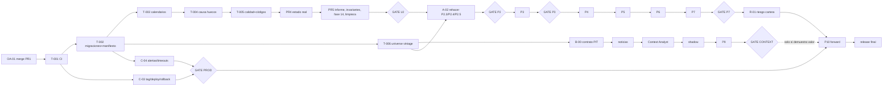

# Roadmap de intradia-bot

Fuente principal de **qué falta, qué depende de qué, qué está hecho, qué
está bloqueado, en qué orden y cuándo está terminado**. No contiene el
detalle operativo de cada tarea: eso vive en `docs/tareas/` y el método en
`docs/metodo-trabajo.md`.

| Documento | Para qué |
|---|---|
| `docs/metodo-trabajo.md` | Cómo se ejecuta cualquier tarea (obligatorio) |
| `docs/agent-workflow.md` | START HERE, reparto Opus/Codex, prompts, cola |
| `docs/gates.md` | Puertas entre bloques y paquete de revisión final |
| `docs/decision-log.md` | Decisiones tomadas; decisiones y acciones del propietario |
| `docs/tareas/T-nnn-*.md` | Fichas de tarea |
| `docs/plan-ejecucion.md` | Detalle de las fases 4–15 de la línea 0 |
| `docs/protocolo-investigacion.md` | Cómo se mide en P2–P7 |
| `docs/ratio-beneficio-riesgo.md` | Hallazgo medido sobre el ratio (histórico, vigente) |
| `docs/pendientes.md`, `docs/cobertura-especificacion.md` | **Históricos** (D-16): mediciones y diario hasta el 2 de septiembre; no son estado |
| `evidence/` | Evidencia reproducible por entrega |

---

## Estado verificado — 2026-09-16

Comprobado directamente contra el repositorio y ejecutando el sistema, no
leído en documentos:

| Qué | Valor |
|---|---|
| Rama / HEAD | **`main` en `d7acff7`**: T-003 y T-004 dentro; la cadena se fusionó en fast-forward el 2026-09-16 |
| Árbol | limpio salvo `graphify-out/` (sin seguimiento) |
| Tests / lint / tipos | 469 pasan (90 s) · `ruff check .` limpio · `mypy advisor` limpio (59 ficheros) · Python 3.12.13. Verificado el 2026-09-16 |
| PR 1 (fases 1–3) | hecho en rama: `advisor/analysis/execution.py`, `entry_max_for_rr`, `reward_risk`, `rr_at_least`, `position_limit_reason`, `classify_setup` separado de `classify`, regresión `EXH1.DE` |
| CI | `.github/workflows/ci.yml` en rama `ci/github-actions` (`e5ed089`), run verde en 3.12 y 3.13 |
| Esquema SQLite | v2 con migraciones (`PRAGMA user_version`), backup pre-migración verificado, `analysis_run` + `run_id` (T-002) |
| Calendarios | `advisor/data/calendars.py` con `exchange_calendars==4.13.2` y cripto 24/7; taxonomía única en `MARKET_SESSIONS` con MIC. T-003 **aceptada** el 2026-09-16 tras revisión independiente; rama sin mergear y sin desplegar |
| Universo | **103 analizables** + 19 contexto + 4 dados de baja el 2026-09-18 (D-31); 92 ISIN verificados; 95 disponibles, 10 `no` analizables, 0 sin comprobar; seleccionado el 2026-08-27/29 |
| Cosecha | `071ddb2b…`, 126 símbolos, 5 años, solo en el portátil (`data/vintages/` ignorado, 18 MB); manifiesto 87 KB |
| LLM | `claude-sonnet-5` vía `advisor/ai/`; prompt sin versión; narrativa **no** se persiste |
| Pi | `fer@Raspberry4` (192.168.1.113, clave `~/.ssh/id_ed25519_rpi_bot`): **corre el tag `v0.4.0` = `84ea28e` desde el 2026-09-26**, **esquema v6** (migración v5 → v6 hecha y verificada), `verificar-release` en `EN_TAG`, caché de barras activa (`validated_bar = 3228` tras la primera pasada, `ea08c727…`; evidencia en `evidence/2026-09-26-despliegue-v040/`). Antes, **`v0.3.0` = `03e1ec3` desde el 2026-09-20**, esquema v5; 93 analizables y 68 `EXECUTABLE` / 21 `STALE_DATA` / 4 `MISSING_RECENT_DATA` en la primera pasada con la regla nueva (`evidence/2026-09-20-despliegue-v030/`). Antes: **desplegada `main` `c2ff1d7` el 2026-09-18** con la línea 0 completa (GATE L0) y el universo de 103. Sin migración (v4). 547 tests + 3 saltados en la Pi; `verificar-systemd` alineadas; pasada supervisada con código 0; manifiesto con vintage `c8496446…`; `BROKER_UNVERIFIED` 57 → 0, `EXECUTABLE` 0 → 49. Evidencia en `evidence/2026-09-18-despliegue-pi/` |
| Línea base real | `evidence/2026-09-14-L0-baseline/`: 107 activos; calidad OK 59 / INCOMPLETO 30 / DEGRADADO 18; 43 con «sesiones ausentes»; 1 OPERAR (`EXH1.DE`), 10 RADAR, 90 DESCARTADOS |
| Efecto de T-003 sobre esa base | OK 63 / INCOMPLETO 28 / DEGRADADO 16; 44 con ausencias, todas reales; **0 activos cambian de radar o de acción** (recalculado el 2026-09-16) |

---

## Auditoría del roadmap anterior — qué cambia y por qué

Cada punto: qué cambió · por qué · qué evita.

1. **La línea C (ingeniería) existe y va por delante de PR 3.** CI,
   migraciones y manifiesto de ejecución (T-001, T-002) se hacen antes de que
   PR 3 y PR 4 añadan columnas y estados · porque el esquema no tiene versión
   y las pasadas no tienen identidad · evita migrar dos veces y producir
   recomendaciones irreproducibles durante la línea 0. (D-19)
2. **PR 1 cambió la política de entrada y hay que decirlo.** Con la geometría
   por defecto `entry_max_rr = precio de cierre` exactamente, así que
   `entry_max_atr: 0.75` no interviene y toda apertura al alza es
   `ABOVE_MAX_ENTRY` · el protocolo (hallazgo 4) había aplazado justo esto a
   P4 · la decisión D-06 mantiene la invariante y traslada la tensión a P4
   («holgura de entrada» como dimensión de la geometría) y a la fase 14
   (medir la pérdida a la apertura). Evita descubrir en P10 que casi nada es
   ejecutable a la apertura.
3. **El sesgo de universo se acota formalmente y P7 deja de ser «validación
   general».** Sección «Universo» abajo; `universe_vintage_id` (T-006);
   etiqueta obligatoria en P6/P7; **P10 Forward Validation** como prueba
   final no condicionada. (D-08)
4. **Calendarios de plaza reales, una sola taxonomía.** La línea base
   demuestra falsos huecos por festivos ajenos (`AZN` vetada por Labor Day)
   · se adopta `exchange_calendars` (D-07) y se elimina `_mercado_por_sufijo`
   · evita vetos falsos y dos vocabularios para la misma plaza.
5. **Corrección de una afirmación del roadmap anterior:** «`POLICY_TODAS` es
   la población de control del estudio y también se mueve». El event study
   (P2.3) entra al cierre de señal y **no** depende de `entry_max`; lo que se
   mueve es el backtest (`POLICY_OPERAR`/`TODAS`, entrada a la apertura
   siguiente). P2.3/P2.4 se rehacen igualmente por la fortaleza relativa y por
   la línea 0 (D-18), pero por el motivo correcto.
6. **«Recalibrar con los 107» ya no es una fase.** P2.3 ya midió 121.786
   señales sobre los 107; lo que salía de 21 activos era el `backtest` antiguo
   (`europa`, `usa_en_xetra`, `etfs_ucits`). Se retira como fase y se conserva
   como nota histórica.
7. **Fases nuevas que faltaban:** versionado y regresiones del LLM (B-06,
   C-05), reloj/NTP (C-02, C-04), despliegue por tag y rollback (C-03),
   restauración de backups probada (C-01), riesgo de cartera con gate
   (R-01), forward validation (V-01), identidad emisor/instrumento (T-006,
   D-20), ficha de proveedor obligatoria (B-00).
8. **Observación nueva:** `YahooEarningsSource` consulta «próximos
   resultados» en vivo; no es point-in-time y no puede usarse en backtests
   sin el contrato B0. Hoy no puntúa, así que no contamina nada.
9. **«Un commit por fase» se retira** (D-15). Una entrega coherente, commits
   compilables.
10. `docs/pendientes.md` y `docs/cobertura-especificacion.md` pasan a
    históricos (D-16). Este documento es el único estado.

---

## Principios

Reglas de arquitectura; una entrega que las incumpla se devuelve. Las
invariantes numeradas (INV-xx) están en `docs/metodo-trabajo.md` sección 2.

- **Determinismo.** El LLM no calcula indicadores, score, entrada, stop,
  objetivos, RR, tamaño, riesgo ni clasificación. Interpreta lo ya calculado.
- **Point-in-time.** `available_at <= analysis_timestamp` o el dato no entra
  en un backtest.
- **Una función, varios llamantes.** Producción e investigación comparten
  indicadores, fortaleza relativa, niveles, RR, ejecución, score, calendarios.
- **Verde no es verificado.** Tests → ejecución real → un número a mano →
  a cuántos activos afecta.
- **Cuatro conceptos separados:** `setup_quality`, `execution_state`,
  `data_quality`, `broker_state`. Un fallo en una capa no altera otra.
- **Lo desconocido sigue desconocido.** Nunca `unknown → no`, `None → 0`,
  ausencia → estimado, sin regla escrita.
- **Investigación pre-registrada.** Pregunta, métrica primaria, población,
  criterio de aceptación y tratamiento de la incertidumbre antes de medir;
  lo decidido después de ver resultados se etiqueta exploratorio.
- **Toda señal nueva se mide antes de producción** y NO CONCLUYENTE es un
  resultado válido.

---

## Universo: sesgo de supervivencia y de selección

**Hecho.** Los 107 analizables se eligieron el 2026-08-27 y 2026-08-29 con
conocimiento de 2026 (tamaño, liquidez, notoriedad, presencia en Trade
Republic) y se miden desde 2021. Ninguno ha sido excluido de cotización;
`ARM`, `DFEN.DE`, `Q8Y0.DE` son jóvenes. No hay fuente gratuita de
constituyentes históricos ni de exclusiones.

**Identidad del universo (A-00, D-23).** El vintage vigente es
`c8496446d9b04795b8533e25e794c6141a4e73db73c0ef9bf98599b70f952132` (D-31,
2026-09-18: 103 analizables tras cuatro bajas por no estar en el broker; el
anterior, `894ce776…`, era el de los 107), y **se mueve con cada cambio de la lista**, porque el `instrument_id` de un activo pasa de
`SYMBOL@MARKET` a su ISIN en cuanto se verifica. Todo resultado publicado debe
llevar el vintage con el que se calculó; las pasadas anteriores al 2026-09-17
llevan el id provisional `80d05f21…`, que era solo la lista de símbolos.

`added_at` se derivó comparando las tres versiones de `universe.yaml`: **20
activos del 2026-08-27 y 106 del 2026-08-29**. Los ocho listados alemanes del
universo inicial que pasaron a su símbolo primario (`APC.DE` → `AAPL` y
compañía) son **instrumentos distintos**, no renombrados, porque cambian plaza,
calendario, divisa y fuente de barras. Consecuencia vinculante: **ningún
resultado sobre `AAPL` y los otros siete puede reclamar antigüedad del 27 de
agosto**, aunque su emisor ya estuviera considerado.

**Sesgos presentes, por orden de gravedad:**

| Sesgo | Efecto sobre la medición |
|---|---|
| Supervivencia | Solo activos que llegaron a 2026: la tasa de desplomes y quiebras está subestimada; la expectancy larga, sobreestimada |
| Selección con información futura | Elegidos por ser grandes/fuertes en 2026: deriva alcista media superior a la del mercado en el periodo |
| Conocimiento futuro en benchmarks | `benchmark` por activo elegido en 2026. Solo 2 de los 107 lo declaran; los otros 105 lo heredan de `config.yaml`, que el vintage **no** hashea: ese lado lo pinea `config_hash` en el manifiesto |
| Selección por disponibilidad en el broker | Desde el 2026-09-17, 10 activos están marcados no disponibles y quedan vetados. El universo **analizado** no cambia, pero el **ejecutable** sí, y no es el mismo con el que se midió el pasado |

**Qué se puede afirmar y qué no** (regla vinculante hasta P10):

| Afirmación | Permitida | Condición |
|---|---|---|
| «La política B mejora a la A en ΔR por bloque» (P4, P2.6, pareado por `signal_id`) | Sí | Ambas medidas sobre las mismas señales: el sesgo afecta a las dos por igual. Etiqueta: «condicionado al universo 2026» |
| «El score ordena entre bandas» (P3) | Sí, con cautela | Las dimensiones de momento correlacionan con lo que hizo sobrevivir a estos activos; publicar también la ordenación **dentro** de cada activo (por bloques temporales), que el sesgo de selección no infla |
| «Expectancy neta X R, CAGR Y %, drawdown Z %» (P6, P7) | Solo con etiqueta | «Fuera de muestra en el tiempo, condicionado al universo seleccionado en 2026; cota optimista». Publicar siempre el exceso sobre el buy-and-hold del propio universo en la misma ventana |
| «El sistema tiene ventaja» (general) | **No** | Solo tras P10 |

**Mecanismo:** `universe_vintage_id` (T-006) en cada manifiesto y resultado;
cualquier cambio en la lista → vintage nuevo + entrada en el decision log
(INV-19); campos `added_at`, `valid_to`, `delisted_at`, `ticker_history`
presentes desde ya, vacíos hasta que haga falta. Si aparece una fuente de
constituyentes históricos, se abre A-08 y P7 se repite.

---

## Líneas de trabajo

Estados: `HECHO` · `EN_CURSO` · `PENDIENTE` · `BLOQUEADO(por)` ·
`OBSOLETO`. Cada fila con ficha enlaza a `docs/tareas/`.

### Línea 0 — Correctitud operativa y del dato (delante de todo)

Mientras esté abierta, **nada** de la línea A recalibra. Detalle en
`docs/plan-ejecucion.md`.

| ID | Fase | Estado | Depende de | Ficha |
|---|---|---|---|---|
| PR 1 | Fases 1–3: RR desde precio efectivo, `entry_max` por RR, setup vs ejecución, sizing desde entrada efectiva | HECHO y en `main` (`e929da4`, fusionado el 2026-09-16) | — | — |
| PR 2 | Fase 4 calendarios de plaza · fase 6 cripto 24/7 · unificar taxonomía | **HECHA: aceptada, en `main` y desplegada** (2026-09-16) | T-002 | T-003 |
| PR 2 | Fase 5 causa de los huecos 2026-09-07 y 2026-03-06 | **HECHA** (2026-09-16, revisión independiente CORREGIR con 7 defectos, corregidos y verificados). Tres causas: 4 pares eran cierre real de KRX que la librería no codifica, 43 son huecos del proveedor con la plaza abierta, 0 del pipeline | T-003 | T-004 |
| PR 3 | Fases 7–8 calidad por dimensiones + códigos de descarte | **HECHA: aceptada, en `main` y desplegada** (2026-09-17). Dos revisiones independientes, las dos CORREGIR: la 1.ª con 3 defectos y 4 avisos, la 2.ª con 4 de alcance (el segundo camino de `DataQuality`, el aviso de precio extendido perdido y sin persistir, `_skip_code` atribuyendo causas y tests que faltaban). Todo corregido y verificado; evidencia rehecha en `evidence/2026-09-17-T-005-correcciones/` | T-002, T-003, T-004 | T-005 |
| PR 4 | Fases 9–11 estado de mercado, «último cierre», reevaluación tras apertura, broker, ISIN `EXH1.DE` | **ACEPTADA** (2026-09-18). Revisión independiente CORREGIR: un BLOCKER —`VERIFICAR_BROKER` sacaba a los activos sin verificar de la población de `POLICY_OPERAR` del backtest y los borraba de su informe, contra D-04 e INV-04— y un fallo de `market_state` con `datetime` sin zona; los dos corregidos con tests que fallan contra el código sin corregir. ISIN `DE000A0H08M3` cruzado contra la ficha del emisor. Incorpora un defecto medido que no estaba en el plan: `trim_unclosed_bar` usaba el cierre **regular** y descartaba barras ya cerradas en días de media sesión; muerde por primera vez el 2026-11-27. La ficha se escribió con los 107 activos en `unknown`; tras OA-03 quedan 2 | PR 3 | **T-007** |
| PR 5 | Fases 12–13 informe + siete invariantes de integración | **ACEPTADA** (2026-09-18). Revisión independiente CORREGIR: la invariante 1 era vacua (pasaba con la guarda de ejecución quitada) y un cambio de contrato —intercambiar `ABOVE_MAX_ENTRY` y `RR_TOO_LOW`— iba declarado como SAME_SCOPE pese a que `execution_code` se persiste; los dos corregidos. Medido: el RR manda en 102 de los 107, la técnica en 5 | PR 4 | **T-008** |
| PR 5 | Fase 14 filtro de ejecución medido aparte del score, incl. pérdida por `ABOVE_MAX_ENTRY` a la apertura (D-06) | **ACEPTADA** (2026-09-18). Entregada BLOQUEADA por su autor con razón: el criterio «el backtest no cambia» era inverificable porque el backtest en vivo no es reproducible (891/893/890 en el mismo commit). Sustituido por comparación determinista, idéntica byte a byte. Revisión: se publicaba el centinela `[0,1]` como intervalo; corregido. **Medido: el filtro rechaza más de la mitad de lo que el score aprueba**, y lo ejecutado rinde 0,21 R por bloque frente a 0,12 de lo rechazado, con intervalos solapados | PR 4 | **T-009** |
| PR 5 | Fase 15 limpieza → **GATE L0** | **ACEPTADA — GATE L0 CRUZADO** (2026-09-18, D-30). Seis métricas medidas juntas sobre `main`, la 6 en la Pi; tres huérfanas borradas, una de ellas `apply_migrations`, que migraba sin backup; 13 hallazgos abiertos resueltos o con ficha; suite también en clon limpio. Casilla 26 del plan abierta con T-015 | todo lo anterior + C-00..C-02 | **T-010** |

### Línea C — Ingeniería de producción (transversal; C-00..C-02 antes de PR 3)

| ID | Qué | Estado | Depende de | Ficha |
|---|---|---|---|---|
| C-00 | CI: pytest, ruff, mypy en push/PR; branch protection (OA-02) | HECHO y en `main` (`e5ed089`); OA-02 pendiente del propietario | — | T-001 |
| C-01 | Migraciones `user_version`, backup pre-migración, `verificar-backup` | HECHO (T-002, revisión independiente aplicada; ver evidencia) | C-00 | T-002 |
| C-02 | Manifiesto de ejecución (`run_id`, SHA, config hash, vintages, versiones, reloj) | HECHO (T-002; reloj medido vía `timesync-status`/`chronyc`/SNTP UDP; alerta Telegram pendiente en C-04) | C-01 | T-002 |
| C-07 | Backtest reproducible sobre cosecha congelada; el modo en vivo declara que no lo es | **ACEPTADA**, en `main` y en la Pi desde `v0.3.0` (2026-09-20). `backtest --vintage` da 866 operaciones idénticas byte a byte en tres pasadas; en vivo, 869/862/867 el mismo día (D-34). Las cifras publicadas antes quedan etiquetadas como no reproducibles y se rehacen en A-02 | — | **T-015** |
| C-08 | Higiene del manifiesto y del esquema: `git_dirty` nullable, `config_hash` sin rutas, `backup_log` migrado, vintage por grupo — una sola migración, junto con T-011 | **ACEPTADA** (2026-09-18, `v0.2.0`). Migración v4→v5 aplicada en la Pi: 25 manifiestos antiguos conservados con `config_hash_version = 1`. Revisión independiente de Codex aplicada | C-01, C-02 | **T-017** |
| C-03 | Release por tag, `verificar-release` en la Pi, despliegue y rollback documentados y probados | **ACEPTADA** (2026-09-18). `v0.2.0` publicado por CI y desplegado; `verificar-release` da `EN_TAG` en la Pi; **rollback ejecutado de verdad** sobre la base real y documentado en `evidence/2026-09-18-OA-04-ensayo-release/` | C-00 | **T-011** |
| C-04 | Logs rotados, alertas Telegram (pasada fallida, proveedor caído, reloj > 60 s, `events.yaml` caduca), timeouts y reintentos por proveedor, degradación sin red probada | PENDIENTE | C-02 | por escribir |
| C-09 | **Caché local de barras de sesión cerrada ya validadas (D-40, D-41)**: el proveedor **retira** por la noche una barra que ya sirvió, y el bot la vio la tarde anterior, así que la caché va **primero** y la segunda fuente queda **condicionada** a una cifra que la propia ficha produce: sesión exigible + nunca observada + no entregada. No pasa por B-00 (no es fuente externa); la segunda fuente sí, si llega | **ACEPTADA** (2026-09-25, **PR #24 fusionado**): las cinco reglas implementadas, esquema **v6** (`validated_bar`, `validated_bar_revision` y cuatro columnas en la medición), contador de valor marginal por pasada y acumulado deduplicado por par activo-sesión, y **D-44** resolviendo la regla 4 —manda la primera validada— y la distinción entre reajuste de la serie y revisión de una barra. **665 tests**, `ruff` y `mypy` limpios. **17 hallazgos** de la revisión cruzada corregidos, cada uno con su test (3 de diseño y 14 de código, 11 de ellos pasando la suite). Verificación con datos reales: **12 sesiones retiradas al proveedor, 12 restauradas, 0 sin restaurar**. Abre **OD-02 bis**, que queda **abierta a acumulación de datos** y no se decide con una pasada. **DESPLEGADA en la Pi el 2026-09-26** como `v0.4.0` (`84ea28e`): migración v5 → v6 aplicada de forma aislada y verificada, backups manual y `pre-v6` en v5 y válidos, primera pasada real `ea08c727…` con 93 recomendaciones y 93 mediciones, `validated_bar = 3228`, `validated_bar_revision = 0`, timers reactivados (`evidence/2026-09-26-despliegue-v040/`). OD-02 bis acumula evidencia desde esa pasada: 16 sesiones exigibles nunca observadas en 16 ETF de XETRA | — | **T-018** |
| C-05 | Persistir narrativa LLM con provider/model/prompt_version/input_hash (D-12); **y el mecanismo de presupuesto de D-38**: caché por `input_hash`, contador de gasto mensual persistido y degradación limpia al llegar al tope de 10 €/mes | PENDIENTE | C-01 | por escribir |
| C-06 | Backup programado en la Pi + simulacro de restauración trimestral | PENDIENTE | C-01, C-03 | por escribir |

### Línea A — Modelo cuantitativo (arranca al cruzar GATE L0)

| ID | Fase | Estado | Depende de | Ficha |
|---|---|---|---|---|
| A-00 | `universe_vintage_id` + identidad mínima (`issuer_id`, `instrument_id`, `added_at`…) | **ACEPTADA y en `main`** (2026-09-17). Revisión independiente CORREGIR: un BLOCKER de CI, la guarda de INV-08 que no escribía nadie y el vintage ciego al benchmark declarado; los tres corregidos. Vintage vigente `894ce776…`, que se mueve con cada tanda de OA-03 | C-02 | T-006 |
| A-09 | El centinela `(0.0, 1.0)` deja de publicarse como intervalo | PENDIENTE, **ficha escrita y auditoría hecha** (2026-09-18): **0 celdas afectadas** en el veredicto de P2.5 (mínimo 4 bloques; el centinela salta por debajo de 2), así que **ya no bloquea A-02**. Queda como higiene: la función sigue pudiendo fabricar un valor | — | **T-016** |
| A-01 | Interpretar el histórico de frescura de la Pi (recurrencia de huecos) → alimenta OD-02 | **ACEPTADA** (2026-09-20): OD-02 cerrada en D-40 con su cifra (2026-09-20), pendiente solo del propietario. 4.143 mediciones, 39 pasadas, 107 símbolos. **El retraso es exclusivamente europeo: 278/329 a las 06 UTC frente a 0/399 del resto del mundo, y 0/327 en Europa a las 20 UTC.** La respuesta al umbral de OD-02 depende de qué se llame «sesión perdida», que el pre-registro no fijó: 0 activos si el hueco debe persistir, 18 si basta con que faltara alguna vez, 47 contando retrasos. Revisión del supervisor CORREGIR: la entrega no deduplicaba y contaba cada hueco una vez por pasada. Aviso: la ventana cruza 14 versiones de código y solo una pasada usa la regla vigente | acceso a la Pi | **T-012** |
| A-02 | Rehacer P2.3, P2.4 y P2.5 una sola vez sobre `071ddb2b…`, con RS alineada y línea 0; decidir el RR en el score → **GATE P2** | **ACEPTADA** (2026-09-21, D-42 y D-43). **GATE P2 CRUZADO.** Las tres poblaciones reproducen sus hashes y `pre-d31` devuelve las 121.786 señales de agosto; la atribución entre población y corrección de RS **no es observable** con los artefactos de agosto y se declara así (migraciones acotadas en [97, 10.228]). Con el primario de INV-14 el veredicto global es **`INSUFICIENTE`/`LOW`** y **ninguna banda es concluyente**. Revisión independiente pasada; nueve FOLLOW_UP en `evidence/2026-09-21-T-013-laboratorio-rehecho/follow-ups.md` | GATE L0 | **T-013** |
| A-03 | P3 Score v2: dimensiones, pesos, `score_model_version`, umbrales por horizonte, ¿`convicción` fuera del número? → **GATE P3** | **DESBLOQUEADA** el 2026-09-21 (GATE P2 cruzado). D-43 fija el punto de partida: el RR **sale** como dimensión, `score_model_version` nuevo, umbrales recalibrados por horizonte con el estimador primario de INV-14, y **ninguna equivalencia** entre las bandas viejas y las nuevas. Ojo: A-02 midió que ninguna banda es concluyente. **Ficha aprobada el 2026-09-26** como **pre-registro condicionado** de P3 (PR #26; el pre-registro ejecutable será el SHA del paso 2a-doc), con D-45 (medio `calibrated: false`; requisito 2 de GATE P3 corregido), D-46 (`convicción` fuera: v2 = catalizador 20 + técnico 20 + contexto 10), D-47 (transición: producción sigue en v1 con sus 70/60 legacy, no calibrados, hasta el cambio atómico a v2) y D-49 (la regla point-in-time del VIX se fija antes de P3). D-48 se retiró antes de fusionar. Queda pendiente la pregunta de pre-registro sobre el componente asiático. Implementación sin empezar; el esquema nuevo, si hace falta, será v7 | A-02 | **T-019** |
| A-04 | P4 Geometría: stop/objetivo/entrada **incluida la holgura de entrada** (D-06), pareado + bootstrap por bloques, heterogeneidad → **GATE P4** | BLOQUEADO(GATE P3) | A-03 | por escribir |
| A-05 | P5 Regiones robustas → **GATE P5** | BLOQUEADO | A-04 | por escribir |
| A-06 | P6 Sistema completo con exceso sobre buy-and-hold del universo → **GATE P6** | BLOQUEADO | A-05 | por escribir |
| A-07 | P7 Walk-forward + holdout (ventanas fijadas antes en el decision log) → **GATE P7** | BLOQUEADO | A-06 | por escribir |
| A-08 | Universo histórico (solo si aparece fuente de constituyentes) | OPCIONAL | — | — |

### Línea B — Contexto externo (captura en paralelo; nada decide hasta GATE CONTEXT)

| ID | Fase | Estado | Depende de | Ficha |
|---|---|---|---|---|
| B-00 | Contrato point-in-time `advisor/context/models.py` + ficha de proveedor obligatoria → **GATE B0** | PENDIENTE | A-00 | T-014 |
| B-01 | Identidad emisor/instrumento/listing (cubierta por A-00, D-20) | **HECHA con A-00** (2026-09-17). Aviso para la línea B: `issuer_id: ishares` se repite en 13 ETF, así que una noticia de BlackRock mapearía a trece productos cuyo precio lo mueve su índice, no el emisor | A-00 | T-006 |
| B-02 | Collector de noticias (por emisor y macro), dedupe por `content_hash`, sin LLM | BLOQUEADO(B0) | B-00 | por escribir |
| B-03 | Sentimiento: datos primero (conteos, fuente, timestamps); LLM dentro del presupuesto de D-38 | BLOQUEADO(B0) — **OD-03 cerrada** el 2026-09-20 | B-02, C-05 | por escribir |
| B-04 | Fundamentales: magnitudes primarias con fecha de publicación; ratios en Python | BLOQUEADO(B0, OD-01). **D-39** (2026-09-20, sondeo hecho): el plan gratuito de EODHD no incluye fundamentales (403 también en EE. UU., mientras su EOD europeo responde), pero el token `demo` enseña el JSON real de `AAPL.US` con **`filing_date` por línea** en los tres estados. Falta comprobar que venga relleno para un europeo, que pide un mes de pago. `evidence/2026-09-20-OD-01-eodhd-free/` | B-00 | por escribir |
| B-05 | Macro: FRED/BCE/Eurostat con vintage y revisión | BLOQUEADO(B0) | B-00 | por escribir |
| B-06 | Context Analyst (un agente, cinco preguntas, Pydantic) + **regresiones LLM**: no fabrica catalizadores, no usa información no suministrada, no confunde ausencia con neutralidad, no altera números. Solo sobre candidatos que ya pasaron los filtros cuantitativos (D-38) | BLOQUEADO(B0) — **OD-03 cerrada** el 2026-09-20 | B-02, C-05 | por escribir |
| B-07 | Shadow mode: `quant_decision` y `context_shadow_decision` persistidos en paralelo | BLOQUEADO | B-06 | por escribir |
| B-08 | P8 Fundamentals Study | BLOQUEADO(OD-01) | B-04, GATE P3 | por escribir |
| B-09 | P9 Context Study (misma disciplina que P2) → **GATE CONTEXT** | BLOQUEADO | B-07, muestra suficiente | por escribir |
| B-10 | Integración conservadora / Score v3 (solo si P9 demuestra valor; degrada, nunca rescata) | BLOQUEADO(GATE CONTEXT) | B-09 | por escribir |

### Cierre

| ID | Fase | Estado | Depende de |
|---|---|---|---|
| R-01 | Riesgo de cartera: límites diario/semanal, concentración, correlación, divisa → **GATE RISK** | BLOQUEADO(GATE P7) | A-06, A-07 |
| V-01 | **P10 Forward Validation** con tag congelado, duración OD-08 → **GATE P10**. Orientación del propietario (2026-09-20): parar por tiempo **y** por señales cerradas (≥ 8 semanas y ≥ 100); medido sobre la cosecha, 100 señales piden 30-35 semanas, así que manda el número, no el calendario | BLOQUEADO(GATE P7, GATE PROD) | R-01, C-03..C-06 |
| F-01 | Release final + paquete de revisión externa (`docs/gates.md`) | BLOQUEADO(GATE P10) | todo |

### Trabajo manual del propietario (sin atajo)

OA-01 merge PR 1 · OA-02 branch protection · OA-03 89 ISIN y disponibilidad
en Trade Republic de los 107 (con fecha y fuente; no cambia la señal) · OA-04
desplegar tags en la Pi hasta que C-03 lo automatice (`v0.3.0` desplegado el
2026-09-20). Símbolos europeos
(`european_symbol`): ninguno declarado; se verifica uno a uno cuando se
necesite elegir plaza por sesión (no bloquea nada hoy).

---

## Mapa de dependencias

---

## Qué hacer ahora, en este orden

1. **OA-01** (propietario): merge de `fix/execution-data-quality` en `main`.
2. **T-001** CI — Codex.
3. **T-002** migraciones + manifiesto — Codex → Opus.
4. En paralelo: **T-003** calendarios (Codex → Opus) y **T-006** universe
   vintage (Codex → Opus).
5. **T-004** causa de los huecos — Opus.
6. **T-005** calidad + códigos — Opus → Codex → Opus.
7. **T-007..T-010** PR 4 y PR 5 (Opus escribe las fichas con la plantilla al
   cerrar T-005; Codex implementa; Opus revisa) → **GATE L0**.
8. **T-011** C-03 despliegue por tag; OA-04: desplegar `v0.2.0` en la Pi y
   verificar allí.
9. **T-012** A-01 histórico de frescura de la Pi → OD-02 con cifra.
10. **B-00** contrato point-in-time — Opus (puede empezar tras T-006, en
    paralelo con 5–8).
11. **T-013** A-02 rehacer P2.3/P2.4/P2.5 → **GATE P2** (revisión
    independiente obligatoria).
12. P3 → P4 → P5 → P6 → P7, cada uno con su gate; línea B capturando datos;
    C-04..C-06 cuando C-03 esté.
13. R-01, luego V-01 (P10), luego F-01.

---

## Hallazgos abiertos (FOLLOW_UP y OBSERVATION que no tienen ficha)

Triados en T-010 (2026-09-18): de los trece que había, 4 cerrados, 6 con ficha
(C-04, T-014, T-017) y 3 convertidos en notas de fase. Detalle en
`evidence/2026-09-18-L0-cierre/README.md` §5. Quedan aquí solo las notas, que
no son defectos sino condiciones para fases futuras:

- **A-03 (P3):** `^SOX`, `^RUT`, `^TNX`, `DX-Y.NYB`, `CL=F`, `GC=F` no alimentan el contexto de mercado. Medir antes de enchufar.
- **A-04 (P4):** `economic_currency` se guarda y no se usa; descomponer el ATR en riesgo de activo y de divisa es cambio de cálculo, se mide allí. Y `RR_TOO_LOW` es hoy inalcanzable por construcción (D-29); vuelve a ser alcanzable si P4 introduce holgura de entrada, y por eso no se borra.
- **A-06 (P6):** el dividendo cobrado durante una posición de horizonte medio no entra en el P&L del laboratorio (protocolo P2.0); resolver antes de interpretar `medio`.
- **`RR` en el score:** **decidido en D-43** (2026-09-21), que cerró OD-11 y cruzó GATE P2. El RR **sale del score como dimensión de puntuación a partir de P3**, y **sigue siendo condición de ejecutabilidad y de riesgo**: `min_rr`, `entry_max_rr`, la invariante de no recomendar una entrada que viole el RR mínimo y la guarda `RR_TOO_LOW` no se tocan. P3 tiene que crear un **`score_model_version` nuevo** y **recalibrar los umbrales por horizonte** con el estimador primario de INV-14, **sin asumir ninguna equivalencia** entre las bandas viejas y las nuevas. Lo ejecuta A-03.

## Definición de terminado del proyecto

Se cumple cuando **todo** esto es cierto a la vez y está en el paquete de
revisión externa (`docs/gates.md`):

**Modelo.** GATE P2, P3, P4, P5, P6 y P7 cruzados, con `score_model_version`
final y configuración congelada con hash.

**Sesgos.** Universo acotado con `universe_vintage_id` y etiqueta en todo
resultado; look-ahead controlado por el test de equivalencia y la revisión
independiente; point-in-time controlado por GATE B0 en toda fuente externa.

**Contexto.** Noticias, sentimiento, fundamentales y macro almacenados
point-in-time; shadow mode acumulado; P8 y P9 publicados; en producción solo
lo que GATE CONTEXT haya demostrado, y solo degradando.

**Producción.** GATE PROD: CI obligatoria, release por tag, despliegue y
rollback probados, migraciones con backup y restauración probada,
monitorización y alertas, reloj verificado, degradación limpia ante fallos de
proveedor o de IA, la Pi ejecuta exactamente el tag registrado.

**Auditoría.** Toda recomendación lleva `run_id`; reconstrucción probada a
≥ 30 días; versionado de código, config, universo, datos, score y LLM; hashes
en `evidence/`.

**Riesgo.** GATE RISK: riesgo por posición y de cartera, concentración,
correlaciones y límites agregados, declarados en el informe.

**Validación final.** GATE P10 cruzado con configuración congelada y
resultado comparado con P7.

**Operación.** `pytest`, `ruff`, `mypy` limpios en `main`; sin diferencias
entre la Pi y el tag; `events.yaml` vigente; deuda técnica listada en el
paquete.
