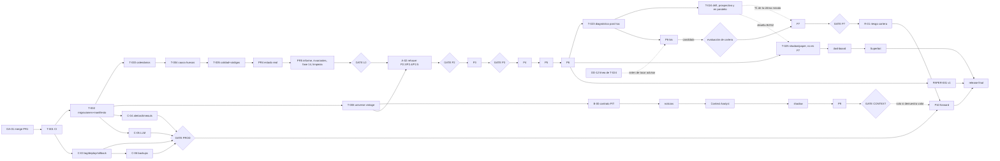

# Roadmap de intradia-bot

Fuente principal de **qué falta, qué depende de qué, qué está hecho, qué
está bloqueado, en qué orden y cuándo está terminado**. No contiene el
detalle operativo de cada tarea: eso vive en `docs/tareas/` y el método en
`docs/metodo-trabajo.md`.

| Documento | Para qué |
|---|---|
| `docs/metodo-trabajo.md` | Cómo se ejecuta cualquier tarea (obligatorio) |
| `docs/agent-workflow.md` | START HERE, reparto Opus/Codex, prompts, cola |
| `docs/gates.md` | Puertas entre bloques y paquete de revisión final |
| `docs/decision-log.md` | Decisiones tomadas; decisiones y acciones del propietario |
| `docs/tareas/T-nnn-*.md` | Fichas de tarea |
| `docs/plan-ejecucion.md` | Detalle de las fases 4–15 de la línea 0 |
| `docs/protocolo-investigacion.md` | Cómo se mide en P2–P7 |
| `docs/ratio-beneficio-riesgo.md` | Hallazgo medido sobre el ratio (histórico, vigente) |
| `docs/pendientes.md`, `docs/cobertura-especificacion.md` | **Históricos** (D-16): mediciones y diario hasta el 2 de septiembre; no son estado |
| `evidence/` | Evidencia reproducible por entrega |

---

## Estado verificado — 2026-10-06 (actualizado el 2026-10-07)

Comprobado contra el repositorio, la CI y la Pi el 2026-10-06. El 2026-10-07 se fusionó el PR #47
(`main = f80ab28`, solo `docs/roadmap.md`) y el propietario cerró OD-T25-1..9 y OD-12 (D-75 a D-77) y OD-T25-10 y OD-T25-11 (D-78);
las filas que lo citan son de esa fecha.

**Terminología (D-74).** La Pi es un **entorno de desarrollo/integración**, no producción. La
producción real será el bot final cuando termine el proceso de validación (GATE P10 y F-01). Las filas
históricas de este documento y del decision log conservan su redacción: en ellas, «producción»
significa «la configuración desplegada en la Pi».

| Qué | Valor |
|---|---|
| Rama / HEAD | **`main` en `f80ab28`** desde el 2026-10-07 (merge del PR #47, solo documentación; el 2026-10-06 estaba en `4170bb4`, merge del PR #46, T-024 contrato de captura forward + Pi 24/7). CI de `main` verde (3.12 y 3.13) |
| Tests / lint / tipos | 1430 pasan y 20 se saltan: 19 necesitan los CSV de `071ddb2b…`, perdidos el 2026-10-06, y 1 requiere `realpath -m` de GNU y corre en CI. `ruff check .` y `mypy advisor` limpios (79 ficheros). Python 3.12.13 |
| Universo | 126 instrumentos, **93 analizables** |
| Laboratorio | GATE P2–P6 cruzados. **P6 cerrado: B2 y S2 `NO PASA`, salida `[]` (D-70); P7 BLOQUEADO.** T-023 (diagnóstico post-P6) **cerrado**. **T-024** (edge relativo al drift, D-71/D-72) **preparado y automático**, en acumulación forward: `T024_PREREG_SHA` `dfcca0ef…`, `T024_CODE_SHA` `1a697c3…`. Los `EXECUTOR_PATHS` de `main` (`f80ab28`) siguen idénticos a `1a697c3`. Desde D-77 (OD-12) T-024 se operará desde la línea dedicada `t024/forward`, que todavía no existe; con visibilidad parcial ex ante del propietario declarada (D-76) |
| Siguiente fase operativa | **T-025 Shadow/Paper Trading Forward** (S-01): pre-registro propuesto (D-74) con **todas las OD cerradas el 2026-10-07 (D-75, D-78)**, **sin congelar**: la revisión final (ronda 5) abrió **OD-T25-12** (reutilizar una ventana de P7 abandonada frente a GATE P7), que bloquea la congelación de `T025_PREREG_SHA` (PR #48). Sin código ni datos forward. **PAPER-001** (P-01) en paralelo: ficha y plan |
| Pi (desarrollo/integración) | Sin cambios: tag **`v0.4.1` = `8b2dddb`**, esquema v7, Score v1 con 70/60 y política C0. Timers `intradia-bot` e `intradia-bot-event` activos. `intradia.db` y sus 21 copias pasan `quick_check` |
| Captura forward T-024 (Pi) | Worktree dedicado `/home/fer/intradia-t024` en `4170bb4`, separado del checkout habitual de la Pi. `/etc/intradia-bot/t024.env`. Timer **`intradia-t024-checkpoint.timer`** habilitado (diario a las 12:00 Atlantic/Canary). **Primera congelación real automática: 2026-11-03.** Probado sin red: la unidad sale con 0 y «sin checkpoint hoy». Runbook: `docs/tareas/T-024-runbook-checkpoint.md` y `deploy/t024/README.md` |
| Cosecha de desarrollo | `071ddb2b…`: **manifiesto versionado intacto; sus 126 CSV se perdieron en el portátil el 2026-10-06** y no se recrearán (`evidence/2026-10-06-incidente-perdida-vintage/`). P6/T-023 conservan su evidencia, pero ya no son reproducibles desde los datos originales |
| Backups | `~/intradia-backups/2026-10-06/` (portátil, fuera del repo y de iCloud): árbol completo y bases de la Pi verificadas |

## Objetivo final y tres velocidades (D-73, 2026-10-06)

**Objetivo: un único bot, el «Superbot».** Tiene que:
- analizar el universo y detectar oportunidades;
- indicar qué comprar, la entrada máxima, el stop, los objetivos, el RR y el tamaño;
- controlar el capital, las posiciones simultáneas y el riesgo de cartera;
- simular en paper trading hasta el cierre, con dashboard y avisos;
- acumular resultados forward reales.

El capital real solo se plantea tras GATE P10. El motor cuantitativo es el de intradia-bot. La capa de
cartera, paper trading y dashboard recoge la filosofía de `trading-bot` (fase S-03).

| Velocidad | Cadena | Regla |
|---|---|---|
| **Bot** | T-025 → paper trading → dashboard → Superbot | Avanza rápido: no espera a P7 |
| **Investigación** | T-024 + P6-bis → nueva candidata → P7 → P10 | Sin trampas: ningún gate se rebaja |
| **Publicación** | P2–P6 y T-023 → PAPER-001 v1; T-024, T-025, P7 y P10 → v2/final | Documenta lo que ya se sabe, con su etiqueta |

Un bot que funciona y simula operaciones **no** es un sistema con ventaja demostrada. Todo lo que
produzca T-025 lleva la etiqueta **«SHADOW / PAPER — estrategia en investigación, no validada para
capital real»**.

**Presupuesto de datos, vinculante (D-72 y D-73):**

| Datos | Quién los consume | Consecuencia |
|---|---|---|
| Sesiones hasta el 2026-08-27 | P2–P6 y T-023 (consumidas) | Solo sirven para desarrollo: código, P6-bis y su filtro de cartera |
| Sesiones desde el 2026-08-28 hasta el `T1` de T-024 | T-024 (decisorio) y T-025 | Los desenlaces de B2, S2 y **C0** quedan **sellados** en T-025 hasta que T-024 se resuelva para B2 y S2 (D-73, D-75); su información ex ante es visible (D-76); P6-bis no las usa |
| Desenlaces que se consulten en T-025 | T-025 | **Consumidos** por sesión, para cualquier política o cohorte (D-74 §3, D-75): no pueden ser holdout virgen de P7. Quedan registrados en `paper_outcome_access`. P6-bis no los usa |
| Después de la congelación de la candidata **y** del `T1` de la última mirada de T-024 | P7 | Solo sesiones sin desenlace consultado en T-025 y que no hayan intervenido en T-024 ni en P6-bis. La ventana se fija antes de empezar, con sesiones futuras, y desde entonces se sella en T-025 para todas las cohortes, con lo acumulado, hasta su consulta única (D-75) |

## Estado verificado — 2026-09-16 (histórico)

Comprobado directamente contra el repositorio y ejecutando el sistema, no
leído en documentos:

| Qué | Valor |
|---|---|
| Rama / HEAD | **`main` en `d7acff7`**: T-003 y T-004 dentro; la cadena se fusionó en fast-forward el 2026-09-16 |
| Árbol | limpio salvo `graphify-out/` (sin seguimiento) |
| Tests / lint / tipos | 469 pasan (90 s) · `ruff check .` limpio · `mypy advisor` limpio (59 ficheros) · Python 3.12.13. Verificado el 2026-09-16 |
| PR 1 (fases 1–3) | hecho en rama: `advisor/analysis/execution.py`, `entry_max_for_rr`, `reward_risk`, `rr_at_least`, `position_limit_reason`, `classify_setup` separado de `classify`, regresión `EXH1.DE` |
| CI | `.github/workflows/ci.yml` en rama `ci/github-actions` (`e5ed089`), run verde en 3.12 y 3.13 |
| Esquema SQLite | v2 con migraciones (`PRAGMA user_version`), backup pre-migración verificado, `analysis_run` + `run_id` (T-002) |
| Calendarios | `advisor/data/calendars.py` con `exchange_calendars==4.13.2` y cripto 24/7; taxonomía única en `MARKET_SESSIONS` con MIC. T-003 **aceptada** el 2026-09-16 tras revisión independiente; rama sin mergear y sin desplegar |
| Universo | **103 analizables** + 19 contexto + 4 dados de baja el 2026-09-18 (D-31); 92 ISIN verificados; 95 disponibles, 10 `no` analizables, 0 sin comprobar; seleccionado el 2026-08-27/29 |
| Cosecha | `071ddb2b…`, 126 símbolos, 5 años, solo en el portátil (`data/vintages/` ignorado, 18 MB); manifiesto 87 KB |
| LLM | `claude-sonnet-5` vía `advisor/ai/`; prompt sin versión; narrativa **no** se persiste |
| Pi | `fer@Raspberry4` (192.168.1.113, clave `~/.ssh/id_ed25519_rpi_bot`): **corre el tag `v0.4.1` = `8b2dddb` desde el 2026-09-30**, **esquema v7** (migración v6 → v7 aislada y verificada, D-58; despliegue **aceptado**, sin rollback), Score v1 con 70/60 `calibrated: false`, `verificar-release` en `EN_TAG`; primera pasada `693c7e1d…` con 93 recomendaciones (evidencia en `evidence/2026-09-30-despliegue-v041/`). Antes, **`v0.4.0` = `84ea28e` desde el 2026-09-26**, **esquema v6** (migración v5 → v6 hecha y verificada), `verificar-release` en `EN_TAG`, caché de barras activa (`validated_bar = 3228` tras la primera pasada, `ea08c727…`; evidencia en `evidence/2026-09-26-despliegue-v040/`). Antes, **`v0.3.0` = `03e1ec3` desde el 2026-09-20**, esquema v5; 93 analizables y 68 `EXECUTABLE` / 21 `STALE_DATA` / 4 `MISSING_RECENT_DATA` en la primera pasada con la regla nueva (`evidence/2026-09-20-despliegue-v030/`). Antes: **desplegada `main` `c2ff1d7` el 2026-09-18** con la línea 0 completa (GATE L0) y el universo de 103. Sin migración (v4). 547 tests + 3 saltados en la Pi; `verificar-systemd` alineadas; pasada supervisada con código 0; manifiesto con vintage `c8496446…`; `BROKER_UNVERIFIED` 57 → 0, `EXECUTABLE` 0 → 49. Evidencia en `evidence/2026-09-18-despliegue-pi/` |
| Línea base real | `evidence/2026-09-14-L0-baseline/`: 107 activos; calidad OK 59 / INCOMPLETO 30 / DEGRADADO 18; 43 con «sesiones ausentes»; 1 OPERAR (`EXH1.DE`), 10 RADAR, 90 DESCARTADOS |
| Efecto de T-003 sobre esa base | OK 63 / INCOMPLETO 28 / DEGRADADO 16; 44 con ausencias, todas reales; **0 activos cambian de radar o de acción** (recalculado el 2026-09-16) |

---

## Auditoría del roadmap anterior — qué cambia y por qué

Cada punto: qué cambió · por qué · qué evita.

1. **La línea C (ingeniería) existe y va por delante de PR 3.** CI,
   migraciones y manifiesto de ejecución (T-001, T-002) se hacen antes de que
   PR 3 y PR 4 añadan columnas y estados · porque el esquema no tiene versión
   y las pasadas no tienen identidad · evita migrar dos veces y producir
   recomendaciones irreproducibles durante la línea 0. (D-19)
2. **PR 1 cambió la política de entrada y hay que decirlo.** Con la geometría
   por defecto `entry_max_rr = precio de cierre` exactamente, así que
   `entry_max_atr: 0.75` no interviene y toda apertura al alza es
   `ABOVE_MAX_ENTRY` · el protocolo (hallazgo 4) había aplazado justo esto a
   P4 · la decisión D-06 mantiene la invariante y traslada la tensión a P4
   («holgura de entrada» como dimensión de la geometría) y a la fase 14
   (medir la pérdida a la apertura). Evita descubrir en P10 que casi nada es
   ejecutable a la apertura.
3. **El sesgo de universo se acota formalmente y P7 deja de ser «validación
   general».** Sección «Universo» abajo; `universe_vintage_id` (T-006);
   etiqueta obligatoria en P6/P7; **P10 Forward Validation** como prueba
   final no condicionada. (D-08)
4. **Calendarios de plaza reales, una sola taxonomía.** La línea base
   demuestra falsos huecos por festivos ajenos (`AZN` vetada por Labor Day)
   · se adopta `exchange_calendars` (D-07) y se elimina `_mercado_por_sufijo`
   · evita vetos falsos y dos vocabularios para la misma plaza.
5. **Corrección de una afirmación del roadmap anterior:** «`POLICY_TODAS` es
   la población de control del estudio y también se mueve». El event study
   (P2.3) entra al cierre de señal y **no** depende de `entry_max`; lo que se
   mueve es el backtest (`POLICY_OPERAR`/`TODAS`, entrada a la apertura
   siguiente). P2.3/P2.4 se rehacen igualmente por la fortaleza relativa y por
   la línea 0 (D-18), pero por el motivo correcto.
6. **«Recalibrar con los 107» ya no es una fase.** P2.3 ya midió 121.786
   señales sobre los 107; lo que salía de 21 activos era el `backtest` antiguo
   (`europa`, `usa_en_xetra`, `etfs_ucits`). Se retira como fase y se conserva
   como nota histórica.
7. **Fases nuevas que faltaban:** versionado y regresiones del LLM (B-06,
   C-05), reloj/NTP (C-02, C-04), despliegue por tag y rollback (C-03),
   restauración de backups probada (C-01), riesgo de cartera con gate
   (R-01), forward validation (V-01), identidad emisor/instrumento (T-006,
   D-20), ficha de proveedor obligatoria (B-00).
8. **Observación nueva:** `YahooEarningsSource` consulta «próximos
   resultados» en vivo; no es point-in-time y no puede usarse en backtests
   sin el contrato B0. Hoy no puntúa, así que no contamina nada.
9. **«Un commit por fase» se retira** (D-15). Una entrega coherente, commits
   compilables.
10. `docs/pendientes.md` y `docs/cobertura-especificacion.md` pasan a
    históricos (D-16). Este documento es el único estado.

---

## Principios

Reglas de arquitectura; una entrega que las incumpla se devuelve. Las
invariantes numeradas (INV-xx) están en `docs/metodo-trabajo.md` sección 2.

- **Determinismo.** El LLM no calcula indicadores, score, entrada, stop,
  objetivos, RR, tamaño, riesgo ni clasificación. Interpreta lo ya calculado.
- **Point-in-time.** `available_at <= analysis_timestamp` o el dato no entra
  en un backtest.
- **Una función, varios llamantes.** Producción e investigación comparten
  indicadores, fortaleza relativa, niveles, RR, ejecución, score, calendarios.
- **Verde no es verificado.** Tests → ejecución real → un número a mano →
  a cuántos activos afecta.
- **Cuatro conceptos separados:** `setup_quality`, `execution_state`,
  `data_quality`, `broker_state`. Un fallo en una capa no altera otra.
- **Lo desconocido sigue desconocido.** Nunca `unknown → no`, `None → 0`,
  ausencia → estimado, sin regla escrita.
- **Investigación pre-registrada.** Pregunta, métrica primaria, población,
  criterio de aceptación y tratamiento de la incertidumbre antes de medir;
  lo decidido después de ver resultados se etiqueta exploratorio.
- **Toda señal nueva se mide antes de producción** y NO CONCLUYENTE es un
  resultado válido.

---

## Universo: sesgo de supervivencia y de selección

**Hecho.** Los 107 analizables se eligieron el 2026-08-27 y 2026-08-29 con
conocimiento de 2026 (tamaño, liquidez, notoriedad, presencia en Trade
Republic) y se miden desde 2021. Ninguno ha sido excluido de cotización;
`ARM`, `DFEN.DE`, `Q8Y0.DE` son jóvenes. No hay fuente gratuita de
constituyentes históricos ni de exclusiones.

**Identidad del universo (A-00, D-23).** El vintage vigente es
`c8496446d9b04795b8533e25e794c6141a4e73db73c0ef9bf98599b70f952132` (D-31,
2026-09-18: 103 analizables tras cuatro bajas por no estar en el broker; el
anterior, `894ce776…`, era el de los 107), y **se mueve con cada cambio de la lista**, porque el `instrument_id` de un activo pasa de
`SYMBOL@MARKET` a su ISIN en cuanto se verifica. Todo resultado publicado debe
llevar el vintage con el que se calculó; las pasadas anteriores al 2026-09-17
llevan el id provisional `80d05f21…`, que era solo la lista de símbolos.

`added_at` se derivó comparando las tres versiones de `universe.yaml`: **20
activos del 2026-08-27 y 106 del 2026-08-29**. Los ocho listados alemanes del
universo inicial que pasaron a su símbolo primario (`APC.DE` → `AAPL` y
compañía) son **instrumentos distintos**, no renombrados, porque cambian plaza,
calendario, divisa y fuente de barras. Consecuencia vinculante: **ningún
resultado sobre `AAPL` y los otros siete puede reclamar antigüedad del 27 de
agosto**, aunque su emisor ya estuviera considerado.

**Sesgos presentes, por orden de gravedad:**

| Sesgo | Efecto sobre la medición |
|---|---|
| Supervivencia | Solo activos que llegaron a 2026: la tasa de desplomes y quiebras está subestimada; la expectancy larga, sobreestimada |
| Selección con información futura | Elegidos por ser grandes/fuertes en 2026: deriva alcista media superior a la del mercado en el periodo |
| Conocimiento futuro en benchmarks | `benchmark` por activo elegido en 2026. Solo 2 de los 107 lo declaran; los otros 105 lo heredan de `config.yaml`, que el vintage **no** hashea: ese lado lo pinea `config_hash` en el manifiesto |
| Selección por disponibilidad en el broker | Desde el 2026-09-17, 10 activos están marcados no disponibles y quedan vetados. El universo **analizado** no cambia, pero el **ejecutable** sí, y no es el mismo con el que se midió el pasado |

**Qué se puede afirmar y qué no** (regla vinculante hasta P10):

| Afirmación | Permitida | Condición |
|---|---|---|
| «La política B mejora a la A en ΔR por bloque» (P4, P2.6, pareado por `signal_id`) | Sí | Ambas medidas sobre las mismas señales: el sesgo afecta a las dos por igual. Etiqueta: «condicionado al universo 2026» |
| «El score ordena entre bandas» (P3) | Sí, con cautela | Las dimensiones de momento correlacionan con lo que hizo sobrevivir a estos activos; publicar también la ordenación **dentro** de cada activo (por bloques temporales), que el sesgo de selección no infla |
| «Expectancy neta X R, CAGR Y %, drawdown Z %» (P6, P7) | Solo con etiqueta | «Fuera de muestra en el tiempo, condicionado al universo seleccionado en 2026; cota optimista». Publicar siempre el exceso sobre el buy-and-hold del propio universo en la misma ventana |
| «El sistema tiene ventaja» (general) | **No** | Solo tras P10 |

**Mecanismo:** `universe_vintage_id` (T-006) en cada manifiesto y resultado;
cualquier cambio en la lista → vintage nuevo + entrada en el decision log
(INV-19); campos `added_at`, `valid_to`, `delisted_at`, `ticker_history`
presentes desde ya, vacíos hasta que haga falta. Si aparece una fuente de
constituyentes históricos, se abre A-08 y P7 se repite.

---

## Líneas de trabajo

Estados: `HECHO` · `EN_CURSO` · `PENDIENTE` · `BLOQUEADO(por)` ·
`OBSOLETO`. Cada fila con ficha enlaza a `docs/tareas/`.

### Línea 0 — Correctitud operativa y del dato (delante de todo)

Mientras esté abierta, **nada** de la línea A recalibra. Detalle en
`docs/plan-ejecucion.md`.

| ID | Fase | Estado | Depende de | Ficha |
|---|---|---|---|---|
| PR 1 | Fases 1–3: RR desde precio efectivo, `entry_max` por RR, setup vs ejecución, sizing desde entrada efectiva | HECHO y en `main` (`e929da4`, fusionado el 2026-09-16) | — | — |
| PR 2 | Fase 4 calendarios de plaza · fase 6 cripto 24/7 · unificar taxonomía | **HECHA: aceptada, en `main` y desplegada** (2026-09-16) | T-002 | T-003 |
| PR 2 | Fase 5 causa de los huecos 2026-09-07 y 2026-03-06 | **HECHA** (2026-09-16, revisión independiente CORREGIR con 7 defectos, corregidos y verificados). Tres causas: 4 pares eran cierre real de KRX que la librería no codifica, 43 son huecos del proveedor con la plaza abierta, 0 del pipeline | T-003 | T-004 |
| PR 3 | Fases 7–8 calidad por dimensiones + códigos de descarte | **HECHA: aceptada, en `main` y desplegada** (2026-09-17). Dos revisiones independientes, las dos CORREGIR: la 1.ª con 3 defectos y 4 avisos, la 2.ª con 4 de alcance (el segundo camino de `DataQuality`, el aviso de precio extendido perdido y sin persistir, `_skip_code` atribuyendo causas y tests que faltaban). Todo corregido y verificado; evidencia rehecha en `evidence/2026-09-17-T-005-correcciones/` | T-002, T-003, T-004 | T-005 |
| PR 4 | Fases 9–11 estado de mercado, «último cierre», reevaluación tras apertura, broker, ISIN `EXH1.DE` | **ACEPTADA** (2026-09-18). Revisión independiente CORREGIR: un BLOCKER —`VERIFICAR_BROKER` sacaba a los activos sin verificar de la población de `POLICY_OPERAR` del backtest y los borraba de su informe, contra D-04 e INV-04— y un fallo de `market_state` con `datetime` sin zona; los dos corregidos con tests que fallan contra el código sin corregir. ISIN `DE000A0H08M3` cruzado contra la ficha del emisor. Incorpora un defecto medido que no estaba en el plan: `trim_unclosed_bar` usaba el cierre **regular** y descartaba barras ya cerradas en días de media sesión; muerde por primera vez el 2026-11-27. La ficha se escribió con los 107 activos en `unknown`; tras OA-03 quedan 2 | PR 3 | **T-007** |
| PR 5 | Fases 12–13 informe + siete invariantes de integración | **ACEPTADA** (2026-09-18). Revisión independiente CORREGIR: la invariante 1 era vacua (pasaba con la guarda de ejecución quitada) y un cambio de contrato —intercambiar `ABOVE_MAX_ENTRY` y `RR_TOO_LOW`— iba declarado como SAME_SCOPE pese a que `execution_code` se persiste; los dos corregidos. Medido: el RR manda en 102 de los 107, la técnica en 5 | PR 4 | **T-008** |
| PR 5 | Fase 14 filtro de ejecución medido aparte del score, incl. pérdida por `ABOVE_MAX_ENTRY` a la apertura (D-06) | **ACEPTADA** (2026-09-18). Entregada BLOQUEADA por su autor con razón: el criterio «el backtest no cambia» era inverificable porque el backtest en vivo no es reproducible (891/893/890 en el mismo commit). Sustituido por comparación determinista, idéntica byte a byte. Revisión: se publicaba el centinela `[0,1]` como intervalo; corregido. **Medido: el filtro rechaza más de la mitad de lo que el score aprueba**, y lo ejecutado rinde 0,21 R por bloque frente a 0,12 de lo rechazado, con intervalos solapados | PR 4 | **T-009** |
| PR 5 | Fase 15 limpieza → **GATE L0** | **ACEPTADA — GATE L0 CRUZADO** (2026-09-18, D-30). Seis métricas medidas juntas sobre `main`, la 6 en la Pi; tres huérfanas borradas, una de ellas `apply_migrations`, que migraba sin backup; 13 hallazgos abiertos resueltos o con ficha; suite también en clon limpio. Casilla 26 del plan abierta con T-015 | todo lo anterior + C-00..C-02 | **T-010** |

### Línea C — Ingeniería de producción (transversal; C-00..C-02 antes de PR 3)

| ID | Qué | Estado | Depende de | Ficha |
|---|---|---|---|---|
| C-00 | CI: pytest, ruff, mypy en push/PR; branch protection (OA-02) | HECHO y en `main` (`e5ed089`); OA-02 pendiente del propietario | — | T-001 |
| C-01 | Migraciones `user_version`, backup pre-migración, `verificar-backup` | HECHO (T-002, revisión independiente aplicada; ver evidencia) | C-00 | T-002 |
| C-02 | Manifiesto de ejecución (`run_id`, SHA, config hash, vintages, versiones, reloj) | HECHO (T-002; reloj medido vía `timesync-status`/`chronyc`/SNTP UDP; alerta Telegram pendiente en C-04) | C-01 | T-002 |
| C-07 | Backtest reproducible sobre cosecha congelada; el modo en vivo declara que no lo es | **ACEPTADA**, en `main` y en la Pi desde `v0.3.0` (2026-09-20). `backtest --vintage` da 866 operaciones idénticas byte a byte en tres pasadas; en vivo, 869/862/867 el mismo día (D-34). Las cifras publicadas antes quedan etiquetadas como no reproducibles y se rehacen en A-02 | — | **T-015** |
| C-08 | Higiene del manifiesto y del esquema: `git_dirty` nullable, `config_hash` sin rutas, `backup_log` migrado, vintage por grupo — una sola migración, junto con T-011 | **ACEPTADA** (2026-09-18, `v0.2.0`). Migración v4→v5 aplicada en la Pi: 25 manifiestos antiguos conservados con `config_hash_version = 1`. Revisión independiente de Codex aplicada | C-01, C-02 | **T-017** |
| C-03 | Release por tag, `verificar-release` en la Pi, despliegue y rollback documentados y probados | **ACEPTADA** (2026-09-18). `v0.2.0` publicado por CI y desplegado; `verificar-release` da `EN_TAG` en la Pi; **rollback ejecutado de verdad** sobre la base real y documentado en `evidence/2026-09-18-OA-04-ensayo-release/` | C-00 | **T-011** |
| C-04 | Logs rotados, alertas Telegram (pasada fallida, proveedor caído, reloj > 60 s, `events.yaml` caduca), timeouts y reintentos por proveedor, degradación sin red probada | PENDIENTE | C-02 | por escribir |
| C-09 | **Caché local de barras de sesión cerrada ya validadas (D-40, D-41)**: el proveedor **retira** por la noche una barra que ya sirvió, y el bot la vio la tarde anterior, así que la caché va **primero** y la segunda fuente queda **condicionada** a una cifra que la propia ficha produce: sesión exigible + nunca observada + no entregada. No pasa por B-00 (no es fuente externa); la segunda fuente sí, si llega | **ACEPTADA** (2026-09-25, **PR #24 fusionado**): las cinco reglas implementadas, esquema **v6** (`validated_bar`, `validated_bar_revision` y cuatro columnas en la medición), contador de valor marginal por pasada y acumulado deduplicado por par activo-sesión, y **D-44** resolviendo la regla 4 —manda la primera validada— y la distinción entre reajuste de la serie y revisión de una barra. **665 tests**, `ruff` y `mypy` limpios. **17 hallazgos** de la revisión cruzada corregidos, cada uno con su test (3 de diseño y 14 de código, 11 de ellos pasando la suite). Verificación con datos reales: **12 sesiones retiradas al proveedor, 12 restauradas, 0 sin restaurar**. Abre **OD-02 bis**, que queda **abierta a acumulación de datos** y no se decide con una pasada. **DESPLEGADA en la Pi el 2026-09-26** como `v0.4.0` (`84ea28e`): migración v5 → v6 aplicada de forma aislada y verificada, backups manual y `pre-v6` en v5 y válidos, primera pasada real `ea08c727…` con 93 recomendaciones y 93 mediciones, `validated_bar = 3228`, `validated_bar_revision = 0`, timers reactivados (`evidence/2026-09-26-despliegue-v040/`). OD-02 bis acumula evidencia desde esa pasada: 16 sesiones exigibles nunca observadas en 16 ETF de XETRA | — | **T-018** |
| C-05 | Persistir narrativa LLM con provider/model/prompt_version/input_hash (D-12); **y el mecanismo de presupuesto de D-38**: caché por `input_hash`, contador de gasto mensual persistido y degradación limpia al llegar al tope de 10 €/mes | PENDIENTE | C-01 | por escribir |
| C-06 | Backup programado en la Pi + simulacro de restauración trimestral. **Prioridad alta tras el incidente del 2026-10-06 (D-73).** Backup automático de SQLite y de los vintages, segunda copia física, retención, hashes y restauración trimestral real. **El backup nunca vive en el mismo árbol que protege** | PENDIENTE — **PRIORIDAD ALTA** | C-01, C-03 | por escribir |

### Línea A — Modelo cuantitativo (arranca al cruzar GATE L0)

| ID | Fase | Estado | Depende de | Ficha |
|---|---|---|---|---|
| A-00 | `universe_vintage_id` + identidad mínima (`issuer_id`, `instrument_id`, `added_at`…) | **ACEPTADA y en `main`** (2026-09-17). Revisión independiente CORREGIR: un BLOCKER de CI, la guarda de INV-08 que no escribía nadie y el vintage ciego al benchmark declarado; los tres corregidos. Vintage vigente `894ce776…`, que se mueve con cada tanda de OA-03 | C-02 | T-006 |
| A-09 | El centinela `(0.0, 1.0)` deja de publicarse como intervalo | PENDIENTE, **ficha escrita y auditoría hecha** (2026-09-18): **0 celdas afectadas** en el veredicto de P2.5 (mínimo 4 bloques; el centinela salta por debajo de 2), así que **ya no bloquea A-02**. Queda como higiene: la función sigue pudiendo fabricar un valor | — | **T-016** |
| A-01 | Interpretar el histórico de frescura de la Pi (recurrencia de huecos) → alimenta OD-02 | **ACEPTADA** (2026-09-20): OD-02 cerrada en D-40 con su cifra (2026-09-20), pendiente solo del propietario. 4.143 mediciones, 39 pasadas, 107 símbolos. **El retraso es exclusivamente europeo: 278/329 a las 06 UTC frente a 0/399 del resto del mundo, y 0/327 en Europa a las 20 UTC.** La respuesta al umbral de OD-02 depende de qué se llame «sesión perdida», que el pre-registro no fijó: 0 activos si el hueco debe persistir, 18 si basta con que faltara alguna vez, 47 contando retrasos. Revisión del supervisor CORREGIR: la entrega no deduplicaba y contaba cada hueco una vez por pasada. Aviso: la ventana cruza 14 versiones de código y solo una pasada usa la regla vigente | acceso a la Pi | **T-012** |
| A-02 | Rehacer P2.3, P2.4 y P2.5 una sola vez sobre `071ddb2b…`, con RS alineada y línea 0; decidir el RR en el score → **GATE P2** | **ACEPTADA** (2026-09-21, D-42 y D-43). **GATE P2 CRUZADO.** Las tres poblaciones reproducen sus hashes y `pre-d31` devuelve las 121.786 señales de agosto; la atribución entre población y corrección de RS **no es observable** con los artefactos de agosto y se declara así (migraciones acotadas en [97, 10.228]). Con el primario de INV-14 el veredicto global es **`INSUFICIENTE`/`LOW`** y **ninguna banda es concluyente**. Revisión independiente pasada; nueve FOLLOW_UP en `evidence/2026-09-21-T-013-laboratorio-rehecho/follow-ups.md` | GATE L0 | **T-013** |
| A-03 | P3 Score v2: dimensiones, pesos, `score_model_version`, umbrales por horizonte, ¿`convicción` fuera del número? → **GATE P3** | **ACEPTADA — GATE P3 CRUZADO** el 2026-10-01 (D-62), con el veredicto NO CONCLUYENTE: los tres horizontes `calibrated: false`, sin umbrales v2, y producción sigue en v1 con 70/60 (D-47). La revisión independiente final del look-ahead no encontró ningún BLOCKER ni ningún IMPORTANTE (`evidence/2026-10-01-T-019-cierre/`). _Condicionado al universo seleccionado en 2026 (sesgo de supervivencia y selección no corregido)._ Historia: **DESBLOQUEADA** el 2026-09-21 (GATE P2 cruzado). D-43 fija el punto de partida: el RR **sale** como dimensión, `score_model_version` nuevo, umbrales recalibrados por horizonte con el estimador primario de INV-14, y **ninguna equivalencia** entre las bandas viejas y las nuevas. Ojo: A-02 midió que ninguna banda es concluyente. **Ficha aprobada el 2026-09-26** como **pre-registro condicionado** de P3 (PR #26; el pre-registro ejecutable será el SHA del paso 2a-doc), con D-45 (medio `calibrated: false`; requisito 2 de GATE P3 corregido), D-46 (`convicción` fuera: v2 = catalizador 20 + técnico 20 + contexto 10), D-47 (transición: producción sigue en v1 con sus 70/60 legacy, no calibrados, hasta el cambio atómico a v2) y D-49 (la regla point-in-time del VIX se fija antes de P3). D-48 se retiró antes de fusionar. **Paso 1 hecho** el 2026-09-29 (contrato de umbrales por horizonte y migración v7, sin cambio de comportamiento; backtest idéntico a A-02). **2a-doc cerrado el 2026-09-29: pre-registro completo y ejecutable de P3**. Decisiones: D-50 (`analysis_timestamp` = última pasada programada antes de la apertura de entrada), D-51 (cripto fuera de P3), D-52 (Asia con sesiones cerradas, cinco series, sin imputar), D-53 (VIX y tendencia point-in-time, una sola función de contexto; defecto de `_naive_dates` registrado, A-02 intacta), D-54 (cinco cierres reales de plaza), D-55 (historia insuficiente de la SMA200 → exclusión), D-56 (hueco puntual de `^STOXX50E` → último cierre causal) y D-57 (Bonferroni `m = 20`). Población de P3: 90 activos, 94.094 señales swing en 19 bloques y 89.333 medio en 5 bloques; 329 comparaciones en swing y 309 en medio. **2a-code** (`782e462`, revisión previa de look-ahead sin BLOCKER), D-59/D-60 y **paso 2** (`5953300`, Score v2 sin activar) hechos el 2026-09-30. **P3 ejecutado una sola vez** el 2026-09-30 sobre `87309da` (PR #33, `evidence/2026-09-30-T-019-paso3-p3/`): swing Δ Q5−Q1 −0,2895 R [−0,4098, −0,1658], anchura 0,2440 > 0,20 → **NO CONCLUYENTE**; ningún candidato cumple OPERAR. **Paso 4 hecho el 2026-10-01 (D-61): resultado publicado, sin umbrales v2; swing, medio e intradía `calibrated: false`**; producción sigue en v1 con 70/60 (D-47). Impacto v1→v2 en `evidence/2026-10-01-T-019-score-v2/`. **Paso 5 hecho el 2026-10-01:** revisión final y cruce de GATE P3 (D-62) | A-02 | **T-019** |
| A-04 | P4 Geometría: stop/objetivo/entrada **incluida la holgura de entrada** (D-06), pareado + bootstrap por bloques, heterogeneidad → **GATE P4** | **ACEPTADA — GATE P4 CRUZADO** el 2026-10-02 (D-64 y D-65). P4 se ejecutó una sola vez (`P4_CODE_SHA` `3df8230`, `P4_RUN_HEAD_SHA` `c2c52b1`, evidencia `cfa365d`). **B2 (objetivo 2 a 4,875·ATR) y S2 (stop 2,5·ATR, objetivo 3,75·ATR) pasan a P5 como candidatas**; S1 no pasa; E1 (entrada a la apertura) NO CONCLUYENTE; B1 solo descriptiva. Heterogeneidad ALTA explicada y no vetante (D-63). 447 comparaciones, 4 confirmatorias. Producción sin cambios: C0 sigue en `config.yaml` | A-03 | **T-020** |
| A-05 | P5 Regiones robustas → **GATE P5** | **ACEPTADA — GATE P5 CRUZADO** el 2026-10-03 (D-67 y D-68). P5 se ejecutó una sola vez (`P5_CODE_SHA` `6c7f913`, `P5_RUN_HEAD_SHA` `282b1ce`, evidencia `86ddd5b`). **B2 y S2 ROBUSTA**: 13/13 vecinos ACEPTABLES, 6/6 LOCRO con IC95 > 0, 71/71 comparaciones, 0 confirmatorias nuevas. **Políticas candidatas `[B2, S2]`** con su config completa y su hash (`evidence/2026-10-03-T-021-p5-cierre/politicas-finales.json`). Ninguna se activa: producción sigue en C0. _Condicionado al universo seleccionado en 2026 (sesgo de supervivencia y selección no corregido)._ | A-04 | **T-021** |
| A-06 | P6 Sistema completo con exceso sobre buy-and-hold del universo → **GATE P6** | **ACEPTADA — GATE P6 CRUZADO** el 2026-10-05 (D-70). P6 se ejecutó una sola vez (`P6_PREREG_SHA` `03f04a4`, `P6_CODE_SHA` `bc0636d`, `P6_RUN_HEAD_SHA` `353876d`, evidencia `0771989`). **B2 `NO PASA` y S2 `NO PASA`; salida `[]`.** Las dos cumplen N ≥ 100, PF local > 1, R medio local > 0 y DD ≥ −25 %, y fallan solo el exceso de CAGR sobre el buy-and-hold del universo (B2 −15,77 pp; S2 −18,72 pp; benchmark CAGR 33,80 %). C0, la sensibilidad de 10 pb y el puente de todas las barras son descriptivos y no cambian la salida. El gate exige la medición completa y reproducible, no un resultado favorable. Cierre en `evidence/2026-10-05-T-022-p6-cierre/`. Producción no cambia: sigue en C0. _Condicionado al universo seleccionado en 2026 (sesgo de supervivencia y selección no corregido)._ | A-05 | **T-022** |
| A-07 | P7 Walk-forward + holdout (ventanas fijadas antes en el decision log) → **GATE P7** | **BLOQUEADO — sin supervivientes de P6** (D-70, salida `[]`). No se elimina ni se rebaja (D-73): validará fuera de muestra una **candidata de P6-bis** (A-11). Empieza después de la congelación de la candidata y del `T1` de la última mirada de T-024 (OD-T24-11), solo con sesiones sin desenlace consultado en T-025 (regla de consumo de D-74 §3, por sesión según D-75) y que no hayan intervenido en T-024 ni en P6-bis; su ventana, fijada antes con sesiones futuras, se sella en T-025 para todas las cohortes hasta su consulta única (D-75). Su pre-registro declara la exposición ex ante de T-025 (D-76). Si se cruza, desbloquea R-01 y V-01 | A-11 | por escribir |
| A-08 | Universo histórico (solo si aparece fuente de constituyentes) | OPCIONAL | — | — |
| A-10 | **T-024 — Edge relativo al drift** (D-71, D-72). Ver el bloque de abajo | **EN_CURSO — acumulación forward**, autónoma en la Pi | A-06 | **T-024** |
| A-11 | **P6-bis — de señal a cartera** (D-73). ¿Se conserva la señal B2/S2 y se mejora su transformación en cartera? Hay tres bloques, cada uno con su pre-registro, y **nunca se cambian la señal y la cartera a la vez**: **(A)** gestión de ganadores (objetivo fijo, trailing, salida parcial, extensión, salida temporal); **(B)** asignación de capital (prioridad entre señales simultáneas, concentración, sizing, reserva de cash, máximo de posiciones), sobre todo para la saturación de cash de B2 (T-023: exposición media 0,8371); **(C)** participación, sobre todo el capital ocioso de S2 (exposición media 0,6054, frente a 0,5313 de C0; rechazo principal `ABOVE_MAX_ENTRY`). **Datos:** solo sesiones hasta el 2026-08-27 inclusive, en una cosecha nueva con su `data_vintage_id`, ya que los CSV de `071ddb2b…` se perdieron. Están consumidas, así que el filtro de cartera «equivalente a P6» es **desarrollo, no confirmación**. **Salida:** o ninguna candidata (se vuelve a investigación y no se fuerza P7), o **una candidata congelada** (config, código, entrada, salida, sizing, asignación, costes, universo y hashes) que pasa una **evaluación de cartera equivalente a GATE P6**, pre-registrada, y solo entonces va a A-07. Su código toca `advisor/`: antes de fusionarlo en `main` tiene que existir `t024/forward` (D-77) | PENDIENTE — diseño | A-06, T-023, `t024/forward` (D-77) | por escribir |

**T-024 — Edge relativo al drift (D-71, D-72).** Es investigación nueva y no cambia P6: B2 y S2 siguen
`NO PASA` y P7 sigue BLOQUEADO. Antes de tocar la selección, el sizing, el cash o la geometría, mide si las
señales tienen ventaja frente al drift del propio activo, solo con sesiones posteriores al 2026-08-27.
Ya **no es trabajo diario**: corre solo en la Pi, en paralelo al resto.
- **Pre-registro y código congelados:** `dfcca0ef` y `1a697c3`. El contrato de captura con petición
  exacta `start`/`end` entró con el PR #46, sin cambiar ninguna regla metodológica.
- **Acumulación forward:**
  - **fase A (Pi):** el primer día hábil de cada mes, la Pi congela la cosecha y para;
  - **fase B (PC):** el PC la copia, la registra y cuenta solo `Q_p`/`W_p`, sin desenlaces.
- **Primer checkpoint: 2026-11-03**, con `end` 2026-10-26.
- **Mirada 1:** cuando B2 y S2 cumplan `Q ≥ 120` y `W ≥ 26`. Previsiblemente hacia mediados de 2027, y
  como tarde en la mirada final con corte el 2027-08-27.
- **Hace:** captura mensual → vintage congelado → segunda copia → hashes. **No hace:** operaciones,
  desenlaces, D2 antes de la mirada ni cambios de estrategia.
- **Su resultado desella los desenlaces de B2 y S2 en T-025** (D-73).

### Línea S — Shadow trading y Superbot (velocidad «bot»; D-73)

No espera a P7 ni a T-024. Todo lo que produce lleva la etiqueta **«SHADOW / PAPER — estrategia en
investigación, no validada para capital real»**.

| ID | Qué | Estado | Depende de | Ficha |
|---|---|---|---|---|
| S-01 | **T-025 Shadow/Paper Trading Forward diario.** `análisis → recomendación → orden simulada → ejecución simulada → cartera paper → seguimiento → cierre → resultado`, con reglas congeladas antes de cualquier desenlace. B2 y S2 tal como están en `politicas-finales.json`, sobre el contrato de sistema de P6 (100.000 EUR, 0,5 % de riesgo, 10 % máximo, 0,10 % + 5 pb, rechazo sin cash); C0 solo como control descriptivo y BH como benchmark. 100.000 EUR por libro, B2 y S2 en libros independientes. **Base `paper.db` aparte y paquete `paper/` fuera de `advisor/`** (D-75): ninguna posición paper puede confundirse con una manual. Durante el embargo de T-024 se ve la **información ex ante** de B2, S2 y C0 (señal, niveles, tamaño como fracción, ejecución simulada de entrada y rechazos de mercado) y quedan **sellados sus desenlaces** hasta que T-024 se resuelva (D-73, D-75, D-76). Sin ventas sintéticas: `DATA_LOSS / SUSPENDED` (D-75). Toda observación con desenlace consultado queda consumida por sesión y no puede ser holdout de P7. **No desbloquea P7, no es P10 y no valida B2 ni S2.** Es la capa paper del Superbot | **PRE-REGISTRO PROPUESTO, todas las OD cerradas (D-75, D-78), sin congelar**: OD-T25-12 abierta; la congelación de `T025_PREREG_SHA` espera a ella (PR #48). Sin código | GATE P6, T-024 congelado | **T-025** |
| S-02 | **Dashboard shadow.** Dos zonas mientras dure el embargo de T-024: **visible ex ante** (qué habría comprado hoy, con qué niveles, qué fracción de la equity, si la apertura lo permitía y los rechazos de mercado con su motivo) y **sellada** (estado posterior, salidas, P&L, equity, cash derivado y métricas, sin ninguna cifra). Al desellar, cómo evoluciona y con qué resultado. Campos en T-025 §14 | PENDIENTE | S-01 | por escribir |
| S-03 | **Superbot: convergencia con `trading-bot`.** El motor cuantitativo de intradia-bot más la capa de cartera de trading-bot. **Dashboard:** capital inicial, equity, cash, posiciones abiertas y cerradas, rentabilidad, drawdown, benchmark, recomendaciones actuales, B2/S2 y rechazos con motivo. **Paper broker automático:** señal → orden → entrada → posición → stop/objetivo → cierre → P&L, sin registro manual. **Historial reconstruible** desde `run_id` + SHA + config + datos + reglas | PENDIENTE — puede adelantarse en parte | S-01, S-02 | por escribir |

### Línea P — Publicación (velocidad «paper»; D-73)

| ID | Qué | Estado | Depende de | Ficha |
|---|---|---|---|---|
| P-01 | **PAPER-001 v1 — «From Trade-Level Edge to Portfolio-Level Underperformance».** ¿Por qué una estrategia con expectancy positiva, PF > 1 y robustez local puede no generar alfa de cartera? Evidencia de D-70: **B2** PF 1,3995, mean R 0,2478, DD −16,60 %, exceso CAGR −15,77 pp; **S2** PF 1,4044, mean R 0,2383, DD −11,23 %, exceso CAGR −18,72 pp; benchmark CAGR 33,80 %. Separa lo **confirmatorio** (P2–P6), lo **post hoc** (T-023) y lo **prospectivo** (T-024 y T-025). Declara la pérdida de los CSV de `071ddb2b…`: los resultados, hashes, commits y evidencia permanecen, pero el cálculo ya no se puede reproducir desde esos CSV. Entregables: manuscrito, tablas, figuras, metodología, discusión, limitaciones y apéndice de reproducibilidad. Puede salir como **preprint** antes de que termine T-024. _Condicionado al universo seleccionado en 2026._ | PENDIENTE — **ficha y plan creados** (2026-10-06); sin manuscrito | GATE P6, T-023 | **PAPER-001** |
| P-02 | **PAPER-001 v2/final**, que incorpora T-024, T-025, P7 y P10 | BLOQUEADO | P-01, resultados forward | — |

### Línea B — Contexto externo (captura en paralelo; nada decide hasta GATE CONTEXT)

| ID | Fase | Estado | Depende de | Ficha |
|---|---|---|---|---|
| B-00 | Contrato point-in-time `advisor/context/models.py` + ficha de proveedor obligatoria → **GATE B0** | PENDIENTE | A-00 | T-014 |
| B-01 | Identidad emisor/instrumento/listing (cubierta por A-00, D-20) | **HECHA con A-00** (2026-09-17). Aviso para la línea B: `issuer_id: ishares` se repite en 13 ETF, así que una noticia de BlackRock mapearía a trece productos cuyo precio lo mueve su índice, no el emisor | A-00 | T-006 |
| B-02 | Collector de noticias (por emisor y macro), dedupe por `content_hash`, sin LLM | BLOQUEADO(B0) | B-00 | por escribir |
| B-03 | Sentimiento: datos primero (conteos, fuente, timestamps); LLM dentro del presupuesto de D-38 | BLOQUEADO(B0) — **OD-03 cerrada** el 2026-09-20 | B-02, C-05 | por escribir |
| B-04 | Fundamentales: magnitudes primarias con fecha de publicación; ratios en Python | BLOQUEADO(B0, OD-01). **D-39** (2026-09-20, sondeo hecho): el plan gratuito de EODHD no incluye fundamentales (403 también en EE. UU., mientras su EOD europeo responde), pero el token `demo` enseña el JSON real de `AAPL.US` con **`filing_date` por línea** en los tres estados. Falta comprobar que venga relleno para un europeo, que pide un mes de pago. `evidence/2026-09-20-OD-01-eodhd-free/` | B-00 | por escribir |
| B-05 | Macro: FRED/BCE/Eurostat con vintage y revisión | BLOQUEADO(B0) | B-00 | por escribir |
| B-06 | Context Analyst (un agente, cinco preguntas, Pydantic) + **regresiones LLM**: no fabrica catalizadores, no usa información no suministrada, no confunde ausencia con neutralidad, no altera números. Solo sobre candidatos que ya pasaron los filtros cuantitativos (D-38) | BLOQUEADO(B0) — **OD-03 cerrada** el 2026-09-20 | B-02, C-05 | por escribir |
| B-07 | Shadow mode: `quant_decision` y `context_shadow_decision` persistidos en paralelo | BLOQUEADO | B-06 | por escribir |
| B-08 | P8 Fundamentals Study | BLOQUEADO(OD-01) | B-04, GATE P3 | por escribir |
| B-09 | P9 Context Study (misma disciplina que P2) → **GATE CONTEXT** | BLOQUEADO | B-07, muestra suficiente | por escribir |
| B-10 | Integración conservadora / Score v3 (solo si P9 demuestra valor; degrada, nunca rescata) | BLOQUEADO(GATE CONTEXT) | B-09 | por escribir |

### Cierre

| ID | Fase | Estado | Depende de |
|---|---|---|---|
| R-01 | Riesgo de cartera: riesgo máximo por operación, límites diario y semanal, concentración por activo, sector, región y divisa, correlación, posiciones simultáneas y exposición total → **GATE RISK**. La arquitectura puede diseñarse antes, en paralelo con S-03; el gate solo se cierra tras GATE P7 (D-73) | BLOQUEADO(GATE P7) | A-06, A-07 |
| V-01 | **P10 Forward Validation** con tag congelado, duración OD-08 → **GATE P10**. Exige la política, la cartera y el riesgo finales, software estable y una configuración que no cambia durante P10; compara el resultado forward con lo que predijo P7. Orientación del propietario (2026-09-20): parar por tiempo **y** por señales cerradas (≥ 8 semanas y ≥ 100); medido sobre la cosecha, 100 señales piden 30-35 semanas, así que manda el número, no el calendario | BLOQUEADO(GATE P7, GATE PROD) | R-01, C-03..C-06 |
| F-01 | Release final + paquete de revisión externa (`docs/gates.md`, `evidence/final-review/`) con GATE P7, PROD, RISK y P10 cruzados (y CONTEXT si el contexto demuestra valor) + PAPER-001 final (P-02). Es el Superbot terminado | BLOQUEADO(GATE P10) | todo |

### Trabajo manual del propietario (sin atajo)

OA-01 merge PR 1 · OA-02 branch protection · OA-03 89 ISIN y disponibilidad
en Trade Republic de los 107 (con fecha y fuente; no cambia la señal) · OA-04
desplegar tags en la Pi hasta que C-03 lo automatice (`v0.3.0` desplegado el
2026-09-20). Símbolos europeos
(`european_symbol`): ninguno declarado; se verifica uno a uno cuando se
necesite elegir plaza por sesión (no bloquea nada hoy).

---

## Mapa de dependencias

```mermaid
flowchart LR
  OA01[OA-01 merge PR1] --> T001[T-001 CI]
  T001 --> T002[T-002 migraciones+manifiesto]
  T002 --> T003[T-003 calendarios]
  T002 --> T006[T-006 universe vintage]
  T003 --> T004[T-004 causa huecos]
  T004 --> T005[T-005 calidad+códigos]
  T005 --> PR4[PR4 estado real]
  PR4 --> PR5[PR5 informe, invariantes, fase 14, limpieza]
  PR5 --> L0{GATE L0}
  T006 --> B00[B-00 contrato PIT]
  L0 --> A02[A-02 rehacer P2.3/P2.4/P2.5]
  T006 --> A02
  A02 --> P2{GATE P2} --> A03[P3] --> P3{GATE P3} --> A04[P4] --> A05[P5] --> A06[P6]
  A06 --> T023[T-023 diagnóstico post hoc] --> T024[T-024 drift, prospectivo y en paralelo]
  T023 --> A11[P6-bis] -->|candidata| EVC{evaluación de cartera} --> A07[P7] --> P7{GATE P7}
  OD12[OD-12 línea de T-024] -.antes de tocar advisor.-> A11
  T024 -.T1 de la última mirada.-> A07
  A06 --> T025[T-025 shadow/paper, no es P7] --> S02[dashboard] --> S03[Superbot]
  T024 -.desella B2/S2.-> T025
  A06 --> PAP1[PAPER-001 v1]
  B00 --> B02[noticias] --> B06[Context Analyst] --> B07[shadow] --> B09[P9] --> CTX{GATE CONTEXT}
  T001 --> C03[C-03 tag/deploy/rollback] --> PROD{GATE PROD}
  T002 --> C04[C-04 alertas/timeouts] --> PROD
  T002 --> C05[C-05 LLM] --> PROD
  C03 --> C06[C-06 backups] --> PROD
  P7 --> R01[R-01 riesgo cartera] --> V01[P10 forward]
  PROD --> V01
  CTX -.solo si demuestra valor.-> V01
  V01 --> F01[release final]
  S03 --> F01
  PAP1 --> F01
```

---

## Qué hacer ahora, en este orden

Actualizado el 2026-10-06 con D-73 y D-74. La lista anterior (OA-01 a T-013 y P3–P6) está terminada.

| Orden | Trabajo | ¿Espera datos? |
|---:|---|---|
| 1 | **T-025: diseño y pre-registro propuesto** (S-01, D-74), con **OD-T25-1..9 y OD-12 cerradas** el 2026-10-07 (D-75, D-76, D-77), en el PR #48. Falta la revisión final del propietario (OD-T25-10 y OD-T25-11 cerradas en D-78; OD-T25-12 abierta en la revisión final y bloquea la congelación) y la congelación de `T025_PREREG_SHA` | No |
| 1b | **Crear `t024/forward`** desde el último commit compatible (D-77) y mover a ella el worktree de la Pi con el procedimiento de D-77. Antes del primer cambio en los `EXECUTOR_PATHS` de `main` y antes del 2026-11-21 | No |
| 2 | **Implementar T-025** con autorización aparte (ficha §16) y desplegarlo en la Pi como tag, en un worktree y un venv propios por versión del motor (nunca en el checkout habitual ni en el de T-024) | No |
| 3 | **PAPER-001 v1** (P-01): ficha y plan hechos; siguiente, el esqueleto del manuscrito | No |
| 4 | **C-06 backups** | No |
| 5 | **Diseñar P6-bis** (A-11): fichas y pre-registros por bloque. Su código toca `advisor/`: antes de fusionarlo tiene que existir `t024/forward` (D-77) | No |
| 6 | Ejecutar P6-bis sobre una cosecha nueva **solo hasta el 2026-08-27**, con su `data_vintage_id` | No |
| 7 | C-04 robustez | No |
| 8 | C-05 LLM | No |
| 9 | B-00 y línea de contexto | No |
| 10 | **T-024: primer checkpoint el 2026-11-03** (corre solo) | Sí, ocurre solo |
| 11 | T-025 acumula operaciones forward cada día | Sí, en paralelo |
| 12 | Candidata de P6-bis | Según resultados |
| 13 | P7 (A-07) | Requiere candidata y el `T1` de T-024 |
| 14 | R-01 | Tras P7 (el diseño puede adelantarse) |
| 15 | Integración final del Superbot y el dashboard (S-03) | Puede adelantarse en parte |
| 16 | P10 (V-01) | Requiere el sistema congelado |
| 17 | PAPER-001 final, revisión externa y release final (P-02, F-01) | Final |

**Fechas que no se mueven (T-024):**
0. **Antes de fusionar en `main` cualquier cambio en `advisor/`, `config.yaml`, `universe.yaml`,
   `exchange_overrides.yaml`, `pyproject.toml` o `requirements.txt`: crear `t024/forward`** desde el último
   commit compatible (D-77). Desde entonces T-024 se opera solo desde esa línea, y `main` no tiene que seguir
   siendo compatible. Antes de cambiar el venv del bot en la Pi, T-024 necesita su propio venv (D-77, paso 7).
1. **Antes del 2026-11-21: declarar el checkpoint de diciembre** en `deploy/t024/calendario-checkpoints.json`
   **en la línea `t024/forward`** (PR contra ella, fuente oficial citada, revisión normal, `git diff --quiet`
   y `verificar_identidad()`), y mover el worktree de la Pi a ese commit con el procedimiento de D-77. Sin eso,
   desde el 21-nov la unidad sale con 3 cada día. Después, cada mes, con el mismo plazo.
2. **2026-11-03:** primera congelación automática en la Pi.
   - Si sale `NO_APTA`, `ERROR_*`, `INTERRUMPIDO` o `PERDIDO`, decide el propietario: no hay reintento
     automático.
   - Estado: `python deploy/t024/checkpoint.py estado --artefactos /home/fer/t024-forward`, en el worktree.
3. **Tras cada checkpoint, en el PC (fase B):**
   1. `deploy/t024/traer_cosecha.py copiar`;
   2. `registrar` y commit solo de evidencia;
   3. árbol limpio;
   4. `capturar` (solo conteos) y commit.
4. **Mirada 1 de T-024**, cuando un checkpoint cumpla el umbral de capacidad para B2 y S2. Previsiblemente
   hacia mediados de 2027.

**Decisiones del propietario que siguen abiertas**, sin bloquear T-024 ni T-025:
- OD-01, fundamentales (línea B, B-08);
- noticias (B-02);
- si se paga una fuente para las plazas europeas.

Trabajo manual: ver la sección «Trabajo manual del propietario» (ISIN, disponibilidad en Trade Republic y
doble símbolo de Xetra).

**Próximo paso concreto:** abrir T-025 y PAPER-001. T-024 sigue corriendo solo en la Pi.

## Hallazgos abiertos (FOLLOW_UP y OBSERVATION que no tienen ficha)

- **Incidente 2026-10-06** (`evidence/2026-10-06-incidente-perdida-vintage/`):
  - se perdieron los CSV de `071ddb2b…` en el portátil y no se recrearán;
  - P6/T-023 pierden la reproducibilidad desde los datos originales.

  Medidas:
  - guarda de borrado en `deploy/t024/borrado_seguro.py`;
  - red de tests en `tests/red_borrado.py`;
  - segunda copia de cada cosecha forward fuera del checkout.
- **El repositorio está en el Escritorio sincronizado con iCloud Drive.** iCloud reescribe permisos de
  directorios y genera duplicados `* 2.md`. La protección de datos no puede apoyarse en permisos mientras
  siga ahí. Sacarlo de la carpeta sincronizada es una decisión del propietario.
- **Identidad de T-024 frente a la evolución de `main` (OD-12, cerrada en D-77 el 2026-10-07):**
  `verificar_identidad()` exige `EXECUTOR_PATHS` idénticos a `1a697c3`. Hoy `main` (`f80ab28`) lo cumple.
  Decisión: línea dedicada `t024/forward`, todavía por crear, antes del primer cambio en esas rutas en
  `main`. Contrato y procedimiento en D-77.
- **El venv de la Pi lo comparten el bot y T-024:** la identidad de T-024 no cubre las versiones instaladas.
  Antes de cualquier despliegue que cambie el venv del bot, T-024 necesita su propio venv (D-77, paso 7).
- **Checkout habitual de la Pi:** los `manifest.json` de las cosechas forward aparecerán sin
  seguimiento en `/home/fer/intradia-bot/data/vintages/`. No afecta a `verificar-release`, que solo mira
  ficheros versionados.

Triados en T-010 (2026-09-18): de los trece que había, 4 cerrados, 6 con ficha
(C-04, T-014, T-017) y 3 convertidos en notas de fase. Detalle en
`evidence/2026-09-18-L0-cierre/README.md` §5. Quedan aquí solo las notas, que
no son defectos sino condiciones para fases futuras:

- **A-03 (P3):** `^SOX`, `^RUT`, `^TNX`, `DX-Y.NYB`, `CL=F`, `GC=F` no alimentan el contexto de mercado. Medir antes de enchufar.
- **A-04 (P4) — no tratado en P4, sigue abierto tras GATE P4 (D-65):** `economic_currency` se guarda y no se usa; descomponer el ATR en riesgo de activo y de divisa es cambio de cálculo, se mide allí. Y `RR_TOO_LOW` es hoy inalcanzable por construcción (D-29); vuelve a ser alcanzable si P4 introduce holgura de entrada, y por eso no se borra.
- **Instrumento de heterogeneidad (FOLLOW_UP de D-63, sigue ABIERTO tras P4):** en P4 salió ALTA en las cinco comparaciones y no vetó (D-65). `_constant_effect_noise` (P2.6) remuestrea como independientes sesiones que comparten hasta 40 barras de trayectoria. Puede etiquetar ALTA un efecto constante (revisión de T-020, B-1). En P4 es solo una bandera. Antes de darle función de veto en una fase posterior hay que revisar un modelo de ruido que respete esa dependencia.
- **A-06 (P6):** el dividendo cobrado durante una posición de horizonte medio no entra en el P&L del laboratorio (protocolo P2.0); resolver antes de interpretar `medio`.
- **`RR` en el score:** **decidido en D-43** (2026-09-21), que cerró OD-11 y cruzó GATE P2. El RR **sale del score como dimensión de puntuación a partir de P3**, y **sigue siendo condición de ejecutabilidad y de riesgo**: `min_rr`, `entry_max_rr`, la invariante de no recomendar una entrada que viole el RR mínimo y la guarda `RR_TOO_LOW` no se tocan. P3 tiene que crear un **`score_model_version` nuevo** y **recalibrar los umbrales por horizonte** con el estimador primario de INV-14, **sin asumir ninguna equivalencia** entre las bandas viejas y las nuevas. Lo ejecuta A-03.

## Definición de terminado del proyecto

Se cumple cuando **todo** esto es cierto a la vez y está en el paquete de
revisión externa (`docs/gates.md`):

**Modelo.** GATE P2, P3, P4, P5, P6 y P7 cruzados, con `score_model_version`
final y configuración congelada con hash.

**Sesgos.** Universo acotado con `universe_vintage_id` y etiqueta en todo
resultado; look-ahead controlado por el test de equivalencia y la revisión
independiente; point-in-time controlado por GATE B0 en toda fuente externa.

**Contexto.** Noticias, sentimiento, fundamentales y macro almacenados
point-in-time; shadow mode acumulado; P8 y P9 publicados; en producción solo
lo que GATE CONTEXT haya demostrado, y solo degradando.

**Producción.** GATE PROD: CI obligatoria, release por tag, despliegue y
rollback probados, migraciones con backup y restauración probada,
monitorización y alertas, reloj verificado, degradación limpia ante fallos de
proveedor o de IA, la Pi ejecuta exactamente el tag registrado.

**Auditoría.** Toda recomendación lleva `run_id`; reconstrucción probada a
≥ 30 días; versionado de código, config, universo, datos, score y LLM; hashes
en `evidence/`.

**Riesgo.** GATE RISK: riesgo por posición y de cartera, concentración,
correlaciones y límites agregados, declarados en el informe.

**Validación final.** GATE P10 cruzado con configuración congelada y
resultado comparado con P7.

**Superbot (D-73).** Un único bot con el motor de intradia-bot y la capa de
cartera de trading-bot: paper broker automático, dashboard, avisos e historial
reconstruible desde `run_id` + SHA + config + datos + reglas. Toda operación
lleva su etiqueta SHADOW/PAPER hasta GATE P10.

**Publicación.** PAPER-001 final con lo confirmatorio, lo post hoc y lo
prospectivo separados.

**Operación.** `pytest`, `ruff`, `mypy` limpios en `main`; sin diferencias
entre la Pi y el tag; `events.yaml` vigente; deuda técnica listada en el
paquete.
